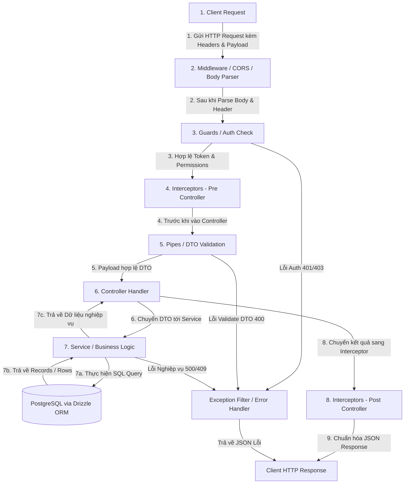

# Luồng Thực Thi Chi Tiết Của Một Module Trong NestJS (Request Lifecycle)

## TL;DR

Tài liệu này giải thích chi tiết luồng luân chuyển của một HTTP Request khi đi qua hệ thống NestJS: từ khi Client gửi dữ liệu đến khi nhận về Response. Luồng thực thi tuân theo thứ tự nghiêm ngặt 8 bước: **Incoming Request -> Middleware -> Guards -> Interceptors (Pre) -> Pipes (DTO Validation) -> Controller -> Service (DB Operations) -> Interceptors (Post) -> Exception Filters -> Client Response**.

---

## Sơ Đồ Luồng Thực Thi Chi Tiết (NestJS Request Lifecycle Diagram)



---

## Chi Tiết Thứ Tự 8 Bước Luân Chuyển Trong Module NestJS

### Bước 1: Client gửi Request

Client (Web, Mobile, Postman) gửi một HTTP Request (ví dụ: `POST /auth/login` kèm theo payload JSON `{ email, password }`).

### Bước 2: Middleware Layer (Tầng Middleware)

- **Nhiệm vụ:** Xử lý thô các yêu cầu mạng trước khi đi vào hệ thống NestJS.
- **Ví dụ phổ biến:** CORS, Body Parser (`express.json()`), Cookie Parser, Logging Middleware.

### Bước 3: Guards Layer (Tầng Bảo vệ & Phân quyền)

- **Nhiệm vụ:** Kiểm tra xem Client có đủ quyền để truy cập Router Handler hay không.
- **Ví dụ phổ biến:** `JwtAuthGuard` (xác thực Token), `RolesGuard` (phân quyền Admin/User).
- **Kết quả:** Nếu không hợp lệ -> Ném lỗi `401 Unauthorized` hoặc `403 Forbidden` ngay lập tức và dừng luồng.

### Bước 4: Interceptors - Pre Controller (Tầng Can thiệp trước)

- **Nhiệm vụ:** Can thiệp vào luồng xử lý trước khi Controller nhận request.
- **Ví dụ phổ biến:** Logging thời gian bắt đầu request, Cache Interceptor (nếu có cache sẵn -> trả về luôn không cần chạy Controller).

### Bước 5: Pipes Layer (Tầng Transform & Validate DTO)

- **Nhiệm vụ:**
  1. Biến đổi dữ liệu (Transform: ví dụ chuyển chuỗi `"123"` thành `number 123`).
  2. Xác minh dữ liệu đầu vào (Validation: sử dụng `ValidationPipe` với `class-validator` / `zod`).
- **Kết quả:** Nếu payload sai DTO -> Ném lỗi `400 Bad Request` chứa chi tiết các trường bị sai.

### Bước 6: Controller (Tầng Định tuyến API)

- **Nhiệm vụ:** Định nghĩa Endpoint (`@Post('login')`), nhận DTO hợp lệ từ Pipes và chuyển dữ liệu tới Service xử lý.
- **Quy tắc:** Controller **không chứa logic nghiệp vụ**, chỉ làm nhiệm vụ điều phối.

### Bước 7: Service & Database Layer (Tầng Logic Nghiệp vụ & Dữ liệu)

- **Nhiệm vụ:**
  1. Thực hiện tính toán, kiểm tra nghiệp vụ (Check email tồn tại, so sánh Hash Password).
  2. Tương tác với Database thông qua `DrizzleDB` (`DATABASE_CONNECTION`).
  3. Trả về kết quả cho Controller.

### Bước 8: Interceptors - Post Controller & Response (Tầng Chuyển đổi dữ liệu trả về)

- **Nhiệm vụ:** Chuẩn hóa cấu trúc Response trả về (Response Formatting) hoặc tính toán tổng thời gian thực thi (Execution Time).
- **Ví dụ trả về:** Trả về HTTP 200 OK với Payload `{ accessToken, refreshToken }`.

---

## Tầng Xử Lý Lỗi Trung Tâm (Exception Filters)

Nếu tại bất kỳ bước nào (Guard, Pipe, Service) xảy ra Exception/Error:

- Luồng thực thi bình thường dừng lại ngay lập tức.
- Exception nhảy sang **Exception Filter** (`HttpExceptionFilter`).
- Format lại lỗi thành JSON chuẩn dạng:

  ```json
  {
    "statusCode": 400,
    "message": [
      "Email không đúng định dạng",
      "Mật khẩu phải có ít nhất 8 ký tự"
    ],
    "error": "Bad Request",
    "timestamp": "2026-07-05T10:00:00.000Z"
  }
  ```

---

## Related Notes & MOC Backlinks

- Thư mục MOC: [[000_Ticket_Booking_MOC]]
- Chiến lược phân tách Auth WBS: [[Auth_WBS_Deconstruction]]
- Đặc tả kiến trúc hệ thống: [[Architecture_and_Spec]]
- Kiến trúc đa giao thức Hybrid: [[Hybrid_Architecture_Strategy]]
