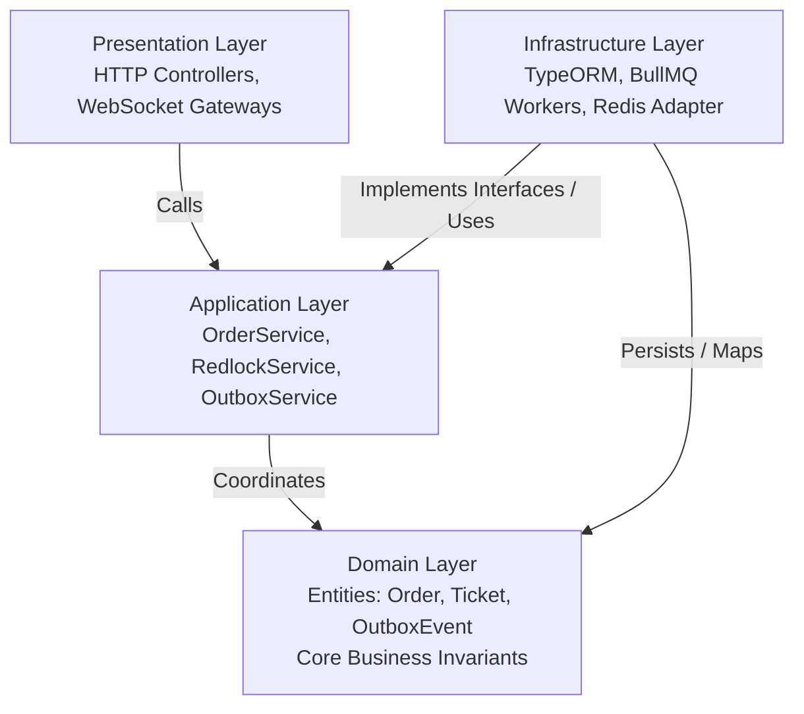
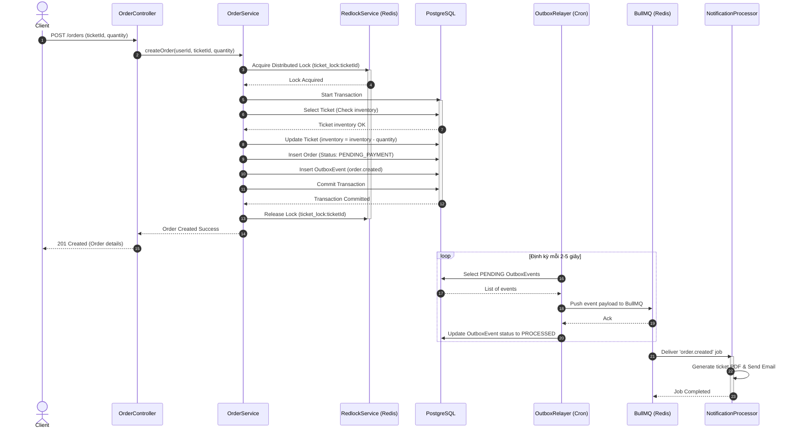

# 📌 Đặc Tả Kiến Trúc & Thiết Kế Hệ Thống Đặt Vé

## TL;DR

Tài liệu này định nghĩa cấu trúc kiến trúc phân lớp (**Clean Architecture**) áp dụng cho hệ thống Ticket Booking Backend. Kiến trúc hướng đến việc cô lập nghiệp vụ cốt lõi (Domain), đảm bảo tính nhất quán dữ liệu dưới tải cao qua cơ chế khóa phân tán (**Redlock**), và xử lý bất đồng bộ đáng tin cậy bằng **Transactional Outbox Pattern** kết hợp với **BullMQ**.

---

## 1. Sơ Đồ Phân Lớp Kiến Trúc (Clean Architecture)

Hệ thống được thiết kế theo mô hình Clean Architecture (tham khảo chi tiết nguyên lý tại [[Clean_Architecture]]), đảm bảo các lớp bên ngoài phụ thuộc vào các lớp bên trong, còn lõi nghiệp vụ (Domain) hoàn toàn độc lập với database và framework.

---

## 2. Chi Tiết Các Lớp

### A. Domain Layer (Lớp Nghiệp Vụ Cốt Lõi)

- **Nhiệm vụ:** Chứa các thực thể (Entities), giá trị (Value Objects) và các quy tắc nghiệp vụ bất biến (Invariants) của hệ thống đặt vé.
- **Quy tắc:** Hoàn toàn tinh khiết (Pure TypeScript), không chứa bất kỳ decorator hay import nào từ NestJS, TypeORM, Prisma, hay Redis.
- **Ví dụ nghiệp vụ bất biến:**
  - Số lượng vé đặt mua trong một đơn hàng phải lớn hơn 0 và nhỏ hơn giới hạn tối đa cho mỗi lượt mua.
  - Số lượng vé còn lại của sự kiện không được phép âm dưới bất kỳ tình huống nào ($Inventory \ge 0$).

### B. Application Layer (Lớp Ứng Dụng / Use Cases)

- **Nhiệm vụ:** Định nghĩa các ca sử dụng (Use Cases) của hệ thống như `CreateOrderUseCase`, điều phối các luồng dữ liệu, thực hiện transaction và kiểm soát concurrency.
- **Thành phần chính:**
  - `OrderService`: Nhận yêu cầu đặt vé, điều phối giao dịch.
  - `RedlockService`: Định nghĩa interface cho việc lấy/giải phóng khóa phân tán (Distributed Lock).
  - `OutboxService`: Định nghĩa cách ghi nhận các sự kiện nghiệp vụ vào hàng chờ outbox.
- **Quy tắc:** Chỉ phụ thuộc vào Domain Layer. Giao tiếp với cơ sở dữ liệu hoặc hệ thống bên ngoài thông qua Interfaces (Dependency Inversion).

### C. Presentation Layer (Lớp Giao Diện / Adapters)

- **Nhiệm vụ:** Tiếp nhận yêu cầu từ client, kiểm tra định dạng đầu vào (Validation) và chuyển đổi kết quả đầu ra.
- **Thành phần chính:**
  - `OrderController`: REST API endpoints (`POST /orders`).
  - `TicketController`: REST API endpoints (`GET /tickets`).
  - `TicketStatusGateway`: WebSocket Gateway (Socket.io) phát tin tức thời về số lượng vé còn lại tới trình duyệt người dùng.

### D. Infrastructure Layer (Lớp Cơ Sở Hạ Tầng)

- **Nhiệm vụ:** Hiện thực hóa các interface ở lớp Application bằng công nghệ cụ thể.
- **Thành phần chính:**
  - **TypeORM/PostgreSQL Repositories:** Thực hiện lưu trữ dữ liệu vật lý và thực thi transaction.
  - **Redis Adapter:** Triển khai cơ chế khóa phân tán thực tế bằng thư viện `redlock`.
  - **BullMQ Integration:** Chứa các background workers thực thi gửi email, sinh vé PDF từ hàng đợi Redis.
  - **Outbox Relayer Job:** Tiến trình chạy ngầm quét bảng `outbox_events` để đẩy sang BullMQ.

---

## 3. Luồng Xử Lý Đồng Thời Khi Đặt Vé (Concurrency Flow)

Sơ đồ tuần tự dưới đây mô tả luồng hoạt động khi có yêu cầu đặt vé từ Client, thể hiện sự kết hợp giữa **Redlock** để chống race condition và **Outbox Pattern** để đảm bảo eventual consistency:

---

## 4. Kế Hoạch Đảm Bảo An Toàn & Phục Hồi Lỗi

1. **DB Crash trước khi Commit:** Dữ liệu Order không được lưu và OutboxEvent không được tạo -> Khóa giải phóng -> Không có lỗi dư thừa, an toàn tuyệt đối.
2. **Redis Crash khi đang gửi email:** Do OutboxEvent đã nằm an toàn trong PostgreSQL, khi Redis/BullMQ hoạt động trở lại, `OutboxRelayer` sẽ quét và gửi lại các event này. Đảm bảo **At-least-once Delivery**.
3. **Tính Idempotency (Trùng lặp sự kiện):** Vì cơ chế "At-least-once" có thể dẫn đến việc đẩy trùng tin nhắn vào hàng đợi, `BullMQ` sẽ dùng `event.id` (UUID) làm `jobId` duy nhất. BullMQ tự động từ chối các job trùng ID nếu nó đã tồn tại trong hàng đợi chưa xử lý, tránh việc gửi email/tạo hóa đơn 2 lần cho khách hàng.
4. **Đảm bảo đồng nhất tuyệt đối DB Transaction (Double-Locking):**
   Để tránh rủi ro rò rỉ khóa phân tán Redlock (ví dụ: lock hết hạn sớm do DB Transaction chạy quá lâu), bước `Select Ticket` ở dòng 97 và `Update Ticket` ở dòng 99 bắt buộc phải sử dụng cơ chế khóa bi quan (**Pessimistic Locking**):
   - Thực thi câu lệnh `SELECT ... FOR UPDATE` khi đọc số lượng vé còn lại của Ticket. Điều này đảm bảo PostgreSQL sẽ khóa dòng dữ liệu đó, ngăn chặn bất kỳ Transaction song song nào thay đổi số lượng cho đến khi Transaction hiện tại commit/rollback.
   - Sự kết hợp của Redlock ở tầng ứng dụng (chặn từ xa) và `FOR UPDATE` ở tầng cơ sở dữ liệu (chốt chặn vật lý cuối cùng) tạo ra một bức tường phòng ngự hai lớp tin cậy tuyệt đối.

---

## Related Notes

- Nguyên lý thiết kế mã nguồn sạch: [[Clean_Architecture]]
- Lý thuyết và mã giả Outbox Pattern: [[Outbox_Pattern]]
- Bản đồ dự án (MOC): [[000_Ticket_Booking_MOC.md|Ticket Booking MOC]]
