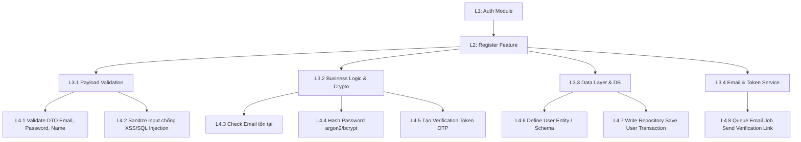
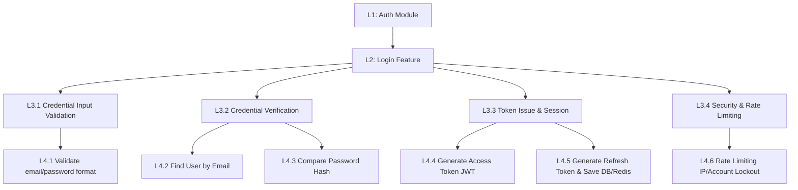

# Chiến Lược Phân Tách Chức Năng Đăng Ký & Đăng Nhập theo Herbert Simon & WBS

## TL;DR

Tài liệu này hướng dẫn cách áp dụng phương pháp phân rã nhận thức **Deconstruction & Chunking** của Giáo sư Herbert A. Simon kết hợp với mô hình **Work Breakdown Structure (WBS)** 4 cấp độ để chia nhỏ hai chức năng phức tạp: **Đăng ký (Register)** và **Đăng nhập (Login)** thành các đơn vị công việc nguyên tử (Atomic Tasks) có thể lập trình và kiểm thử độc lập trong 15-45 phút, giúp tối ưu hóa tải nhận thức (Working Memory) và kiểm soát chất lượng phần mềm.

---

## Core Concept & Theoretical Foundation

### 1. Triết lý Herbert Simon (Cognitive Deconstruction)

- **Giới hạn bộ nhớ làm việc (Working Memory Limits - Miller's Law):** Bộ nhớ ngắn hạn con người chỉ xử lý đồng thời từ 5-9 đơn vị thông tin độc lập (7±2 items). Việc thiết kế/code toàn bộ luồng Auth cùng lúc dễ gây quá tải nhận thức và tạo ra lỗi ẩn (edge-case bugs).
- **Cơ chế Chunking (Gom nhóm thông tin):** Gom nhóm các thao tác xử lý nhỏ rời rạc thành một "khối" (chunk) có ý nghĩa lớn hơn.
- **Thực hành có chủ đích (Deliberate Practice Loop):** Tập trung 100% tài nguyên xử lý vào đúng 1 chunk duy nhất, sau đó tiến hành kiểm thử xác minh (Self-verification) trước khi chuyển sang chunk tiếp theo.

### 2. Cấu trúc Phân rã WBS (4 Cấp độ trong Software Engineering)

- **Level 1 (Module):** Authentication & Authorization
- **Level 2 (Feature):** Register / Login
- **Level 3 (Component Layer):** Payload Validation | Business Logic & Crypto | Data Access Layer (DAL) | Token/Session Management | Security & Rate Limiting
- **Level 4 (Atomic Task):** Đơn vị viết code nhỏ nhất có thể hoàn thành và Unit Test độc lập trong 15-45 phút.

---

## Phân Rã Chức Năng Đăng Ký (Register WBS)

### Chi tiết các Atomic Tasks (Register Chunks)

1. **Chunk 1: Schema & Data Model (DB Layer)**
   - Tạo migration/schema bảng `users` (id, email, password_hash, status, created_at).
   - Viết DTO / Entity và test kết nối database.

2. **Chunk 2: Input Validation (API Gateway / DTO)**
   - Định nghĩa DTO nhận payload `{ email, password, confirmPassword, fullName }`.
   - Cấu hình validate: Email đúng định dạng, Password đáp ứng chuẩn bảo mật (độ dài, ký tự đặc biệt, chữ hoa), Match password & confirmPassword.

3. **Chunk 3: Password Hashing & Security Logic**
   - Cài đặt dịch vụ Bcrypt / Argon2.
   - Viết hàm mã hóa password đồng bộ/bất đồng bộ.

4. **Chunk 4: User Existence & Creation Logic**
   - Viết hàm query DB kiểm tra `email` đã tồn tại hay chưa. Nếu có -> trả lỗi HTTP 409 Conflict.
   - Lưu thông tin user mới vào DB với trạng thái `PENDING_VERIFICATION` (hoặc `ACTIVE` tùy yêu cầu).

5. **Chunk 5: Email Verification & Activation (Nâng cao)**
   - Sinh token xác thực email (random hex / JWT có thời hạn).
   - Gửi mail chứa link xác nhận thông qua Queue/Background Job (Redis/BullMQ hoặc Mailer Service).
   - Xây dựng API `/auth/verify-email?token=xxx` để chuyển trạng thái user sang `ACTIVE`.

---

## Phân Rã Chức Năng Đăng Nhập (Login WBS)

### Chi tiết các Atomic Tasks (Login Chunks)

1. **Chunk 1: Credential Validation & Lookup**
   - Nhận payload `{ email, password }`.
   - Query DB lấy user theo email. Nếu không thấy -> trả lỗi HTTP 401 Unauthorized ("Invalid credentials" - không tiết lộ rõ email hay pass sai).

2. **Chunk 2: Password Comparison**
   - Dùng thư viện Crypto so sánh `password` gửi lên với `password_hash` trong DB.
   - Kiểm tra trạng thái tài khoản (ví dụ: bị khóa `SUSPENDED` hoặc chưa kích hoạt `UNVERIFIED`).

3. **Chunk 3: JWT Access Token & Refresh Token Generation**
   - Định nghĩa Payload của JWT: `{ sub: userId, email, role }`.
   - Sign `access_token` (hạn ngắn, ví dụ 15 phút).
   - Sign `refresh_token` (hạn dài, ví dụ 7 ngày) và lưu Hashed Refresh Token vào DB / Redis.
   - Set Cookie (HttpOnly, Secure, SameSite) hoặc trả Token trong JSON response.

4. **Chunk 4: Rate Limiting & Brute-force Protection**
   - Áp dụng Middleware / Guard Rate Limiter (ví dụ tối đa 5 lần thử trong 1 phút per IP).
   - Cơ chế Account Lockout: Sau 5 lần nhập sai liên tiếp -> tạm khóa tài khoản 15 phút.

5. **Chunk 5: Social Login / OAuth2 (Tùy chọn)**
   - Cấu hình OAuth Strategy (Google / Facebook / GitHub).
   - Xử lý Callback URL, trích xuất email/profile và auto-register/link account nếu lần đầu đăng nhập.

---

## Quy Trình Thực Thi & Kiểm Thử Độc Lập

1. **Một thời điểm - Một Chunk:** Chỉ tập trung viết code và test duy nhất 1 Task ở Cấp 4 (Level 4).
2. **Xác minh độc lập (Self-Verification):** Mọi Chunk sau khi làm xong đều phải có test case bao phủ (Unit Test hoặc Postman call) trước khi chuyển sang Chunk tiếp theo.
3. **Ghép nối tuần tự (Chunk Assembly):** Dùng các Interfaces / Dependency Injection để ghép nối các Chunk đã hoàn thành thành luồng hoàn chỉnh.

---

## Related Notes & MOC Backlinks

- Thư mục MOC: [[000_Ticket_Booking_MOC]]
- Thiết kế Auth Schema & Tách Refresh Token: [[Refresh_Token_Separation_Strategy]]
- Herbert Simon Learning Method: `30_Resources/Concepts/Learning_and_Linguistics/Herbert_Simon_Learning_Method.md`
