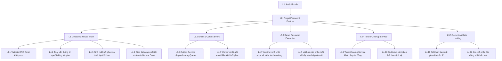
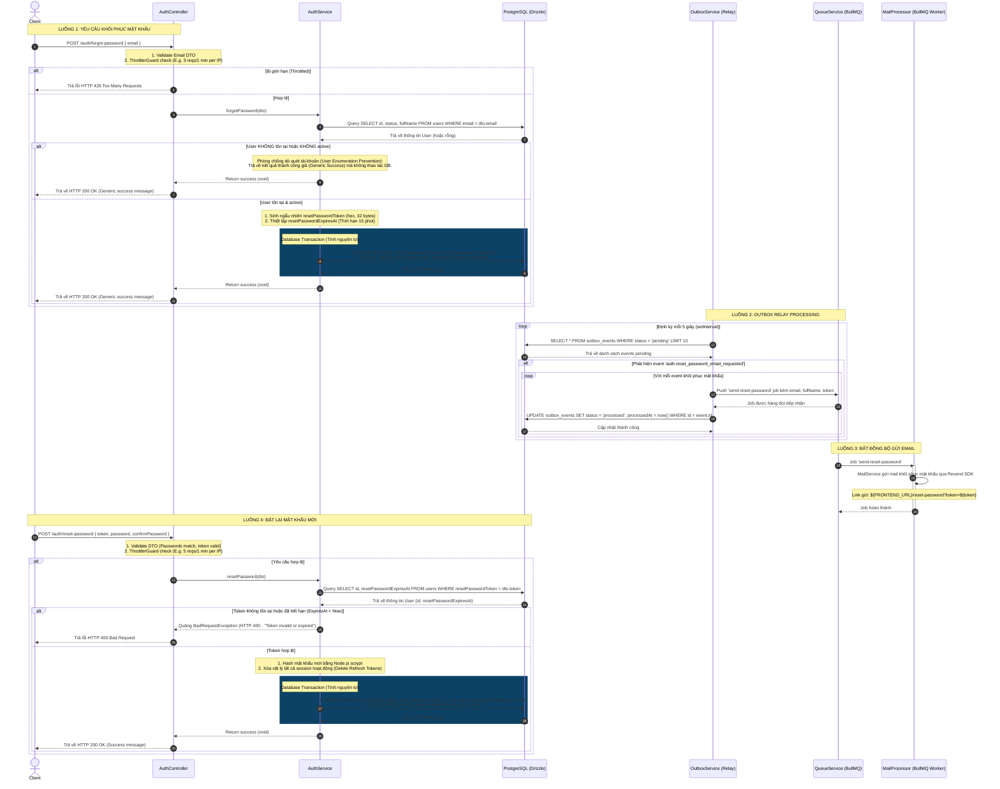

# Phân Tích & Thiết Kế Workflow: Quên Mật Khẩu (Forget Password Flow)

**Trạng thái triển khai**: ✅ Đã hoàn thành (Fully Implemented & Verified)

Tài liệu này phân tích chi tiết thiết kế logic, luồng hoạt động và các quyết định kiến trúc của tính năng Quên mật khẩu (Forget Password) và Đặt lại mật khẩu (Reset Password) thuộc Module Authentication, đảm bảo tính nhất quán dữ liệu qua Transactional Outbox Pattern và bảo vệ chống lại các rủi ro bảo mật chuẩn công nghiệp (User Enumeration, Token Collision, Session Hijacking).

---

## Sơ Đồ Phân Rã Chức Năng (Work Breakdown Structure)



---

## 1. Thiết Kế Database Schema & Chiến Lược Migration (Database Design & Trade-offs)

Hệ thống hiện tại mới chỉ có các trường dành cho xác thực email đăng ký (`verificationToken` và `verificationExpiresAt`). Để chuẩn bị cho bước khôi phục mật khẩu, hệ thống đứng trước ba hướng tiếp cận thiết kế cơ sở dữ liệu:

### So sánh 3 hướng thiết kế Schema

| Phương án                                      | Mô tả                                                                                                                           | Ưu điểm                                                                                                                   | Nhược điểm                                                                                                                                                                                                                                          | Đánh giá                                                                      |
| :--------------------------------------------- | :------------------------------------------------------------------------------------------------------------------------------ | :------------------------------------------------------------------------------------------------------------------------ | :-------------------------------------------------------------------------------------------------------------------------------------------------------------------------------------------------------------------------------------------------- | :---------------------------------------------------------------------------- |
| **A. Tái sử dụng cột hiện tại**                | Dùng chung cột `verificationToken` và `verificationExpiresAt` cho cả 2 luồng.                                                   | - Không phình to schema bảng `users`.                                                                                     | - **Rủi ro Collision & Swap Attack:** Mã xác thực email và mã đổi mật khẩu dùng chung cột sẽ rất dễ bị tráo đổi, tin tặc có thể khai thác để bypass các bước kiểm tra.<br/>- Không cho phép chạy song song hai luồng (vừa kích hoạt vừa khôi phục). | **KHÔNG KHUYẾN NGHỊ** (Mất an toàn bảo mật)                                   |
| **B. Thêm cột chuyên dụng vào bảng `users`**   | Bổ sung `resetPasswordToken` và `resetPasswordExpiresAt` vào trực tiếp bảng `users` (theo đúng pattern của email verification). | - Đồng bộ về mặt pattern thiết kế hiện có.<br/>- Đọc/Ghi nhanh chóng trong 1 câu lệnh cập nhật trực tiếp trên bảng chính. | - Làm bảng `users` phình to thêm cột phụ.<br/>- Khó mở rộng nếu sau này muốn lưu lịch sử khôi phục hoặc hỗ trợ nhiều thiết bị khôi phục đồng thời.                                                                                                  | **KHUYẾN NGHỊ (ƯU TIÊN)** (Đồng bộ, dễ code, đủ an toàn)                      |
| **C. Tách bảng riêng `password_reset_tokens`** | Tạo bảng mới lưu liên kết 1-n: `userId`, `tokenHash`, `expiresAt`.                                                              | - Giữ bảng `users` tinh gọn.<br/>- Hỗ trợ lưu trữ lịch sử hoặc cho phép gửi nhiều token đồng thời.                        | - Tăng chi phí truy vấn (cần JOIN dữ liệu).<br/>- Cần quản lý vòng đời dữ liệu (phải viết cronjob dọn dẹp các token hết hạn trong bảng phụ).                                                                                                        | **KHUYẾN NGHỊ (LỰA CHỌN THAY THẾ)** (Tốt nếu dự án mở rộng nghiệp vụ sau này) |

### Quyết định lựa chọn: Phương án B (Thêm cột chuyên dụng vào bảng `users`)

Để đảm bảo sự đồng nhất với thiết kế hiện tại của Module Auth (vốn đang sử dụng pattern lưu trữ token xác thực trực tiếp trên bảng `users`), hệ thống sẽ lựa chọn **Phương án B** và thực hiện chạy DB Migration bổ sung 2 cột mới.

#### Cấu hình Schema trong Drizzle (`src/database/schemas/auth.schema.ts`)

```typescript
export const users = snakeCase.table(
  "users",
  {
    ...baseEntity,
    email: varchar({ length: 255 }).notNull(),
    fullName: varchar({ length: 255 }).notNull(),
    // ... các trường hiện có ...
    verificationToken: varchar({ length: 255 }),
    verificationExpiresAt: timestamp({ withTimezone: true, mode: "date" }),

    // Bổ sung các trường chuyên dụng cho Quên mật khẩu
    resetPasswordToken: varchar({ length: 255 }),
    resetPasswordExpiresAt: timestamp({ withTimezone: true, mode: "date" }),
  },
  (table) => [
    uniqueIndex("users_email_uidx").on(table.email),
    uniqueIndex("users_verification_token_uidx").on(table.verificationToken),

    // Tối ưu hóa Index cho Quên mật khẩu
    uniqueIndex("users_reset_password_token_uidx").on(table.resetPasswordToken),
    index("users_reset_password_expires_at_idx")
      .on(table.resetPasswordExpiresAt)
      // WHY: Sử dụng camelCase property của Drizzle (`table.resetPasswordToken`) thay vì raw snake_case string để tránh lỗi phát sinh SQL sai khi build migration.
      .where(sql`${table.resetPasswordToken} IS NOT NULL`),
  ],
);
```

> 💡 **Tối ưu hóa bằng Partial Index (Chỉ mục một phần):**
> Chỉ mục `users_reset_password_expires_at_idx` được cấu hình với điều kiện `WHERE reset_password_token IS NOT NULL` ở mức database. Điều này đảm bảo kích thước index luôn ở mức tối thiểu vì chỉ những người dùng đang trong trạng thái yêu cầu khôi phục mật khẩu mới được đưa vào cây index. Khi hoàn thành đổi mật khẩu và token được xóa (`null`), bản ghi sẽ tự động được rút khỏi index này.

---

## 2. Sơ đồ Workflow Quên Mật Khẩu (Forget Password Flow)

Dưới đây là sơ đồ tuần tự xử lý toàn bộ luồng từ lúc yêu cầu gửi link khôi phục mật khẩu cho đến khi cập nhật mật khẩu mới thành công:



---

## 3. Chi Tiết Các Bước Nghiệp Vụ & Thiết Kế Kỹ Thuật

### 3.1 Luồng Gửi Yêu Cầu Khôi Phục (Forgot Password API)

- **Endpoint:** `POST /auth/forgot-password`
- **DTO:** `ForgotPasswordDto` gồm trường `email` (Validate định dạng email chuẩn).
- **Các bước nghiệp vụ chi tiết:**
  - **Kiểm tra Rate Limiting & Đầu vào:**
    - `ThrottlerGuard` kiểm soát tần suất gửi yêu cầu từ IP (tối đa 3 lần/phút).
    - Đầu vào `email` được validate tính hợp lệ bằng class-validator.
  - **Phòng chống dò quét tài khoản (User Enumeration Prevention):**
    - Để ngăn chặn tin tặc phát hiện email nào đã đăng ký trên hệ thống, API khôi phục mật khẩu **bắt buộc phải trả về phản hồi thành công giống nhau** (`HTTP 200 OK` kèm thông báo chung dạng: _"Nếu email của bạn tồn tại trên hệ thống, chúng tôi đã gửi liên kết khôi phục mật khẩu..."_) cho cả hai trường hợp: Email tồn tại hoặc không tồn tại.
    - Về mặt nghiệp vụ: Nếu email không tồn tại trong hệ thống (hoặc tài khoản không ở trạng thái hoạt động), hàm xử lý sẽ lập tức ngắt sớm và trả về thành công giả mà không thực hiện bất kỳ lệnh ghi database hay gửi mail nào để tối ưu hóa tài nguyên.
  - **Truy vấn lấy thông tin tối giản (User Info Selection):**
    - Khi truy vấn kiểm tra sự tồn tại của người dùng, hệ thống chỉ thực hiện `SELECT id, status, fullName` từ bảng `users` dựa vào `email`. Việc này giảm lượng tải dữ liệu truyền từ DB sang application (tránh SELECT `*` chứa password hash hoặc dữ liệu rác không dùng).
  - **Tạo Mã Token Khôi Phục Bảo Mật:**
    - Sinh mã ngẫu nhiên dài 32 byte dưới định dạng hex sử dụng `node:crypto`:

      ```typescript
      const resetToken = crypto.randomBytes(32).toString("hex");
      ```

    - Thiết lập thời gian hết hạn ngắn (15 phút) để thu hẹp cửa sổ tấn công (attack window) nếu token bị rò rỉ:

      ```typescript
      const resetPasswordExpiresAt = new Date(Date.now() + 15 * 60 * 1000);
      ```

  - **Giao dịch ghi Outbox (Atomic Transaction):**
    - Việc cập nhật `resetPasswordToken`, `resetPasswordExpiresAt` vào bảng `users` và chèn bản ghi sự kiện `auth.reset_password_email_requested` vào bảng `outbox_events` phải được thực thi trong duy nhất một Database Transaction để đảm bảo tính toàn vẹn dữ liệu.

### 3.2 Luồng Outbox Relay & BullMQ Worker (Email Dispatch)

- Bổ sung hằng số sự kiện mới vào `src/common/constants/event.constant.ts`:

  ```typescript
  export const OUTBOX_EVENT_TYPE = {
    AUTH_VERIFICATION_EMAIL_REQUESTED: "auth.verification_email_requested",
    AUTH_RESET_PASSWORD_EMAIL_REQUESTED: "auth.reset_password_email_requested", // Thêm mới
  } as const;
  ```

- Cập nhật hàm `dispatch` trong `OutboxService` để đón nhận event mới và đẩy vào queue:

  ```typescript
  case OUTBOX_EVENT_TYPE.AUTH_RESET_PASSWORD_EMAIL_REQUESTED:
    await this.mailQueue.add("send-reset-password", payload);
    break;
  ```

- Cập nhật `MailProcessor` và `MailService` để xử lý job `send-reset-password`, kết nối tới Resend SDK và gửi email kèm liên kết khôi phục trỏ tới Client App (SPA):
  `${env.FRONTEND_URL}/reset-password?token=${token}`

### 3.3 Luồng Xác Thực Mã & Đặt Lại Mật Khẩu (Reset Password API)

- **Endpoint:** `POST /auth/reset-password`
- **DTO:** `ResetPasswordDto` gồm:
  - `token`: Chuỗi hex chứa token bảo mật.
  - `password`: Mật khẩu mới (tối thiểu 8 ký tự, 1 chữ hoa, 1 chữ số).
  - `confirmPassword`: Phải trùng khớp với `password`.
- **Kiểm Tra & Vô Hiệu Hóa Token (Token Invalidation):**
  - Khi người dùng gửi mật khẩu mới kèm token lên, hệ thống sẽ thực hiện truy vấn User tương ứng có mã `resetPasswordToken` trùng khớp.
  - **Chỉ lấy những thông tin cần thiết:** Hệ thống chỉ thực hiện `SELECT id, resetPasswordExpiresAt` để phục vụ việc kiểm tra token và xác thực hết hạn, tránh SELECT `*` gây lãng phí băng thông DB.
  - Kiểm tra xem token đã hết hạn chưa bằng cách so sánh `resetPasswordExpiresAt` với thời gian hiện tại (`new Date()`).
  - Nếu token không tồn tại hoặc đã hết hạn, lập tức ném ra ngoại lệ `BadRequestException` ("Mã khôi phục không hợp lệ hoặc đã hết hạn").
- **Cơ Chế Thu Hồi Session Cũ (Force Logout) - Rất Quan Trọng:**
  - Nhằm ngăn chặn trường hợp tài khoản bị chiếm đoạt thông qua session cũ (hijacked cookies/tokens) sau khi mật khẩu đã được đổi, hệ thống bắt buộc phải **xóa vật lý toàn bộ Refresh Token** đang hoạt động của người dùng đó.
  - Hành động này được thực hiện trong cùng một transaction cập nhật mật khẩu mới:

    ```typescript
    await tx.delete(refreshTokens).where(eq(refreshTokens.userId, user.id));
    ```

  - Sau khi đổi mật khẩu thành công, các trường `resetPasswordToken` và `resetPasswordExpiresAt` trên user phải được cập nhật về `null` để ngăn chặn việc tái sử dụng token (Replay Attack).
- **Quyết định thiết kế (Huỷ phiên vật lý vs. Thu hồi mềm):**
  - Hệ thống sử dụng phương án xóa vật lý (`DELETE`) tất cả các refresh token của người dùng khi đặt lại mật khẩu để đồng bộ với cách thức xoá session của luồng `logout` và `refreshToken` hiện có. Giải pháp này giúp triệt tiêu hoàn toàn rủi ro tích lũy rác dữ liệu, đơn giản hóa schema DB và không yêu cầu quản lý logic soft-revoke phức tạp.
  - **Cơ chế quét dọn tự động:** Dù không sử dụng cờ `isRevoked`, cơ sở dữ liệu vẫn sẽ tích tụ các refresh token hết hạn tự nhiên (do người dùng đóng trình duyệt không click logout). Do đó, ở Giai đoạn 3 hệ thống vẫn cần triển khai một Cronjob / Worker tự động dọn dẹp để quét định kỳ:

    ```sql
    DELETE FROM refresh_tokens WHERE expires_at < NOW();
    ```

## 4. Các Biện Pháp Phòng Thủ Bảo Mật Toàn Diện (Security In-Depth)

Hệ thống khôi phục mật khẩu là một trong những API nhạy cảm nhất và thường xuyên bị bot tấn công spam/dò quét. Do đó, cần áp dụng các cơ chế bảo vệ nghiêm ngặt:

1. **IP-based Rate Limiting (Application Layer):**
   - Áp dụng `@Throttle({ auth: { limit: 3, ttl: 60000 } })` (tối đa 3 lần yêu cầu quên mật khẩu trong vòng 1 phút trên mỗi IP) để ngăn chặn bot spam gửi email rác hàng loạt (Email Flooding).
2. **Preventing Token Leakage (Bảo vệ Token):**
   - Chỉ truyền token bảo mật qua giao thức an toàn HTTPS.
   - Không bao giờ trả về token bảo mật trong payload phản hồi của API `POST /auth/forgot-password`. Token chỉ được gửi qua kênh liên lạc an toàn bên ngoài (Email).
3. **Session Invalidation (Vô hiệu hóa phiên đăng nhập):**
   - Luôn luôn thu hồi/xóa sạch các refresh token cũ ngay khi đặt lại mật khẩu mới thành công, ép buộc mọi thiết bị cũ đã đăng nhập trước đó phải đăng xuất và đăng nhập lại bằng mật khẩu mới.

---

## 5. Kế Hoạch Triển Khai (Implementation Checklist)

### Giai đoạn 1: Database & Schema Migration

- [x] Cập nhật định nghĩa bảng `users` tại `src/database/schemas/auth.schema.ts` bổ sung các trường `resetPasswordToken` và `resetPasswordExpiresAt`.
- [x] Cấu hình Unique Index cho `resetPasswordToken` và Partial Index cho `resetPasswordExpiresAt`.
- [x] Chạy lệnh `bun run db:generate` để tạo file migration SQL.
- [x] Chạy lệnh `bun run db:migrate` để áp dụng cấu trúc bảng mới lên Database PostgreSQL nội bộ.

### Giai đoạn 2: Phát triển Logic Phía Backend (NestJS)

- [x] Khai báo event mới `AUTH_RESET_PASSWORD_EMAIL_REQUESTED` trong `src/common/constants/event.constant.ts`.
- [x] Xây dựng các DTO: `ForgotPasswordDto`, `ResetPasswordDto`.
- [x] Thêm các định nghĩa route mới vào `src/modules/auth/auth.routes.ts`.
- [x] Viết hàm `forgotPassword(dto)` trong `AuthService` xử lý tìm kiếm user, sinh token bảo mật và ghi Transactional Outbox.
- [x] Cập nhật `OutboxService` để dispatch event sang hàng đợi BullMQ với job name `send-reset-password`.
- [x] Viết hàm `sendPasswordResetEmail(email, fullName, token)` trong `MailService` sử dụng SDK Resend để gửi mail kèm link khôi phục mật khẩu.
- [x] Cập nhật `MailProcessor` để xử lý job `send-reset-password` bằng cách gọi trực tiếp `MailService.sendPasswordResetEmail`.
- [x] Đảm bảo sử dụng biến môi trường `env.FRONTEND_URL` trong `MailService` để sinh link khôi phục mật khẩu.

### Giai đoạn 3: Phát triển Cronjob / Worker Tự Động Dọn Dẹp Token (Token Cleanup Job)

- [x] Xây dựng custom `TokenCleanupService` kế thừa `OnApplicationBootstrap` và `OnApplicationShutdown` (không cài đặt `@nestjs/schedule` để giữ hệ thống gọn nhẹ).
- [x] Thiết lập `setInterval` chạy định kỳ mỗi 24 giờ trong `onApplicationBootstrap()`.
- [x] Gọi `clearInterval()` trong `onApplicationShutdown()` để giải phóng timer cưỡng bức tránh rò rỉ bộ nhớ.
- [x] Viết logic dọn dẹp trong `TokenCleanupService`:
  - [x] Thực thi câu lệnh SQL `DELETE` để xóa các refresh token đã hết hạn (`expiresAt < NOW()`).
- [x] Đăng ký `TokenCleanupService` vào `AuthModule` (hoặc `AppModule`) để tự động chạy khi bootstrap hệ thống.

### Giai đoạn 4: Viết Test & Xác Thực

- [x] Viết Integration Test kiểm tra luồng gửi yêu cầu thành công / trả về Generic Success khi email không tồn tại.
- [x] Viết Integration Test kiểm tra luồng đặt lại mật khẩu thành công bằng token hợp lệ.
- [x] Viết Integration Test kiểm tra các trường hợp lỗi: Token sai, Token hết hạn, Mật khẩu mới không khớp mật khẩu xác nhận.
- [x] Kiểm chứng luồng Outbox Relay và xử lý Queue gửi email hoạt động ổn định.
- [x] Viết Unit/Integration Test cho `TokenCleanupService` để đảm bảo cơ chế tự động quét dọn xóa đúng các token hết hạn hợp lệ sau khi chạy.

---

## 6. Bằng Chứng Xác Thực (Verification Evidence)

### Kết Quả Chạy Kiểm Thử (Unit/Integration Tests)

Toàn bộ 56 ca kiểm thử (bao gồm các API mới và Cronjob dọn dẹp) đã vượt qua thành công:

```bash
Ran 56 tests across 8 files. [1023.00ms]
```

### Type Checking & Linting

Biên dịch TypeScript và kiểm tra tĩnh ESLint hoàn tất không có cảnh báo hay lỗi:

```bash
$ tsc --noEmit
# Biên dịch thành công

$ eslint . --fix --cache
# Lint thành công
```

---

## 7. Các Lỗi Đã Khắc Phục (Resolved Issues)

### Lỗi Race Condition trong Outbox Service

- **Hiện tượng:** CSDL ghi nhận trạng thái outbox event là `failed` nhưng thực tế người dùng vẫn nhận được email khôi phục/xác nhận thành công. Ngoài ra, bản ghi bị `failed` nhưng cột `processedAt` lại có giá trị thời gian.
- **Nguyên nhân:** Khi chạy đa server (ví dụ: NestJS dev server chạy nền song song với test runner), cả hai cùng lúc truy cập một bản ghi `pending` do truy vấn select thiếu khóa dòng. Một tiến trình cập nhật thành công thành `processed` kèm `processedAt`, trong khi tiến trình kia bị lỗi và ghi đè trạng thái thành `failed` nhưng không xoá `processedAt`.
- **Giải pháp:**

1. Thay đổi truy vấn select của `OutboxService` sử dụng `.for("update", { skipLocked: true })` để khóa dòng (Row-level Locking) và bỏ qua các bản ghi đang được xử lý bởi tiến trình khác.
2. Đóng gói toàn bộ chu trình truy vấn, xử lý và cập nhật trạng thái vào trong một database transaction duy nhất.
3. Tại khối `catch`, khi cập nhật trạng thái thành `failed`, cột `processedAt` được set rõ ràng về `null` để bảo toàn tính nhất quán dữ liệu.

### Lỗi Gửi Nhầm Email Xác Thực Khi Quên Mật Khẩu

- **Hiện tượng:** Bản ghi `outbox_events` có loại sự kiện là `auth.reset_password_email_requested` nhưng người dùng thực tế lại nhận được email "Xác thực tài khoản của bạn" thay vì email "Khôi phục mật khẩu".
- **Nguyên nhân:** Tiến trình máy chủ chạy nền NestJS dev server (`bun dev`) đang chạy phiên bản mã nguồn cũ (chưa được đồng bộ/rebuild hoặc hot-reload bị kẹt). Trong mã nguồn cũ, file `mail.processor.ts` được viết cứng chỉ gọi duy nhất hàm `sendVerificationEmail` cho mọi tác vụ trong hàng đợi mà không phân chia định tuyến.
- **Giải pháp:**

1. Thực hiện dừng hoàn toàn các tiến trình cũ chạy ngầm và khởi động lại dev server sạch sẽ để đồng bộ hóa mã nguồn mới nhất (có hỗ trợ định tuyến switch-case cho `send-reset-password` và `send-verification`).
2. Refactor logic định tuyến sự kiện trong `OutboxService` từ việc sử dụng switch-case sang một cấu trúc bản đồ tường minh **`EVENT_TO_JOB_MAP`** để liên kết chặt chẽ sự kiện CSDL với job BullMQ, tăng cường khả năng kiểm duyệt (auditability) và loại bỏ hoàn toàn rủi ro sai sót/fall-through.

### Cơ Chế Tự Động Thử Lại (Automatic Retry) Khi Xử Lý Outbox Thất Bại

- **Hiện tượng:** Khi có lỗi tạm thời phát sinh trong quá trình chuyển tiếp sự kiện (ví dụ: mất kết nối Redis tạm thời khi chạy lệnh `mailQueue.add`), bản ghi outbox lập tức bị chuyển trạng thái thành `failed` và không bao giờ được gửi lại. Điều này dẫn đến nguy cơ người dùng bị mất email kích hoạt hoặc email đặt lại mật khẩu.
- **Nguyên nhân:** Phiên bản đầu tiên của `OutboxService` chưa thiết kế cơ chế tự động thử lại (retry) khi gặp lỗi ngoại lệ (`exception`) trong chu trình định tuyến.
- **Giải pháp:**

1. Thực hiện bổ sung thêm hai cột mới vào bảng `outbox_events` trong CSDL:
   - `attempts` (số lần đã thử gửi, mặc định bằng `0`, kiểu dữ liệu `integer`).
   - `last_error` (nội dung lỗi của lần thử thất bại gần nhất, kiểu dữ liệu `text`).
2. Refactor logic trong `OutboxService.processOutbox()`:
   - Khi một sự kiện gửi thành công, cập nhật `attempts = attempts + 1` và đặt `last_error = null`.
   - Khi gặp ngoại lệ, tăng số lần thử lên `attempts = attempts + 1`. Nếu số lần thử nhỏ hơn giới hạn cho phép (`MAX_OUTBOX_ATTEMPTS = 3`), giữ nguyên trạng thái là `"pending"` để công việc được quét và thực thi lại ở chu kỳ tiếp theo (sau 5 giây).
   - Chỉ khi số lần thử vượt quá hoặc bằng `3`, sự kiện mới chính thức bị đánh dấu là `"failed"`, đồng thời lưu lại thông báo lỗi chi tiết vào cột `last_error` để thuận tiện cho việc kiểm toán lỗi.
