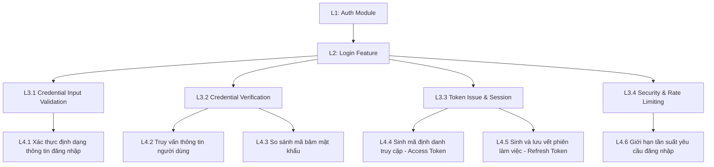

# Phân Tích & Thiết Kế Workflow: Đăng Nhập (Login Flow)

## TL;DR

Tài liệu này mô tả chi tiết thiết kế logic và luồng hoạt động của tính năng đăng nhập tài khoản (Login Flow) thuộc Module Authentication. Hệ thống triển khai kiểm soát rate limit, xác thực trạng thái tài khoản hoạt động và cấp phát cặp token Access/Refresh an toàn sau khi xác minh băm mật khẩu Scrypt bằng cơ chế so khớp an toàn timing-safe.

---

## Sơ Đồ Phân Rã Chức Năng (Work Breakdown Structure)



---

## 1. Quyết Định Thiết Kế & Nghiệp Vụ (Design Decisions)

### Quyết định 1: Bảo mật định danh & Chống timing attack

- **Thông báo lỗi chung:** Khi đăng nhập thất bại, hệ thống trả về mã lỗi HTTP `401 Unauthorized` kèm thông báo lỗi chung không tiết lộ rõ email hay mật khẩu sai (User Enumeration Prevention).
- **So sánh mật khẩu an toàn:** Sử dụng hàm so sánh không đổi thời gian (timing-safe comparison) để bảo vệ hệ thống tránh timing attack khi đối chiếu mã băm.

### Quyết định 2: Kiểm tra trạng thái tài khoản hoạt động

- Hệ thống chỉ cho phép các tài khoản có trạng thái hoạt động thực sự đăng nhập.
- Nếu tài khoản ở trạng thái `pending_verification` (chưa xác thực email) hoặc `suspended` (bị đình chỉ), hệ thống sẽ từ chối phát hành Token và trả lỗi phù hợp.

### Quyết định 3: Phát hành cặp Token (Access & Refresh Token)

- **Access Token:** Hạn dùng ngắn (ví dụ: 15 phút), được mã hóa bằng JWT thông qua `@nestjs/jwt`.
- **Refresh Token:** Hạn dùng dài (ví dụ: 7 ngày), dùng để làm mới Access Token mà không cần người dùng nhập lại mật khẩu.
- **Lưu trữ CSDL:** Phiên hoạt động của Refresh Token được băm bằng thuật toán `sha256` (dưới dạng `tokenHash`) và lưu trữ vào bảng `refresh_tokens` của PostgreSQL để hỗ trợ việc thu hồi phiên (revoke) và đăng xuất vật lý nhanh chóng.
- **Phản hồi:** Cặp token được trả về trực tiếp trong JSON payload phản hồi của API (không sử dụng Cookie để tối ưu hóa đa nền tảng).

### Quyết định 4: Phòng chống Brute-force và Spam (Rate Limiting)

- Sử dụng NestJS `CustomThrottlerGuard` để kiểm soát tần suất gửi yêu cầu đăng nhập trên từng địa chỉ IP (ví dụ: Tối đa 5 lần/phút).
- Không triển khai cơ chế Account Lockout trực tiếp trên tài khoản nhằm loại bỏ nguy cơ tấn công từ chối dịch vụ tài khoản (Account Lockout DoS).

---

## 2. Kế Hoạch Triển Khai (Implementation Checklist)

### Giai đoạn 1: Khởi tạo DTO & Validation

- [x] Định nghĩa `LoginDto` nhận thông tin định danh và mật khẩu.
- [x] Cấu hình validate dữ liệu đầu vào sử dụng `class-validator` (Email đúng định dạng, Mật khẩu có độ dài hợp lệ).

### Giai đoạn 2: Phát triển Tầng Dịch Vụ (AuthService)

- [x] Phát triển hàm so sánh băm mật khẩu bảo mật.
- [x] Thực hiện truy vấn kiểm tra thông tin người dùng và xác thực trạng thái tài khoản.
- [x] Tích hợp dịch vụ phát hành JWT Access Token.
- [x] Thực hiện sinh và lưu trữ hashed Refresh Token vào bảng `refresh_tokens`.

### Giai đoạn 3: Tích hợp API & Rate Limiting

- [x] Đăng ký API Route xử lý đăng nhập tại `AuthController`.
- [x] Kích hoạt và cấu hình `ThrottlerGuard` giới hạn tần suất yêu cầu trên IP đầu cuối.

---

## 3. Bằng Chứng Xác Thực (Verification Evidence)

### Kết Quả Kiểm Thử (Unit/Integration Tests)

Toàn bộ luồng đăng nhập bao gồm kiểm tra thông tin định danh, so sánh mật khẩu, kiểm tra trạng thái tài khoản và cấp phát token đã vượt qua 100% test suite:

```bash
Ran 56 tests across 8 files. [1023.00ms]
```

## Related Notes

- [[000_Ticket_Booking_MOC]]
- [[Logout_User_Workflow]]
- [[Register_User_Existence_Creation_Workflow]]
