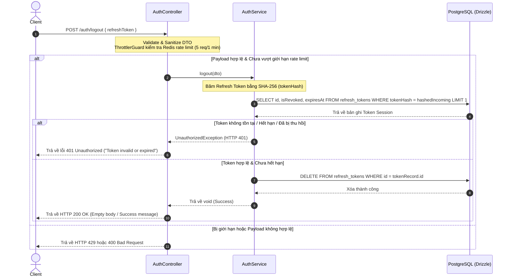

# Phân Tích & Thiết Kế Workflow: Đăng Xuất (Logout Flow)

## TL;DR

Tài liệu này mô tả chi tiết thiết kế logic và luồng hoạt động của tính năng đăng xuất tài khoản (Logout Flow) thuộc Module Authentication. Luồng đăng xuất hoạt động dựa trên cơ chế băm SHA-256 mã `refreshToken` nhận được và đối chiếu để xóa bỏ token session an toàn khỏi CSDL PostgreSQL.

---

## 1. Cơ Chế Hoạt Động (Mechanism)

Tính năng đăng xuất hoạt động trên cơ chế **thu hồi quyền truy cập thông qua Refresh Token**:

- Người dùng gửi yêu cầu đăng xuất kèm theo `refreshToken`.
- Hệ thống thực hiện băm SHA-256 mã `refreshToken` nhận được và đối chiếu với database.
- Nếu token hợp lệ, bản ghi trong bảng `refresh_tokens` tương ứng sẽ bị xóa bỏ hoàn toàn (hoặc chuyển trạng thái thu hồi). Điều này ngăn chặn việc sử dụng lại Refresh Token đó để lấy Access Token mới ở các yêu cầu tiếp theo.
- Client chịu trách nhiệm xóa Access Token và Refresh Token khỏi bộ nhớ cục bộ (Local Storage / Memory).

---

## 2. Sơ Đồ Workflow Đăng Xuất (Logout Flow)

Dưới đây là sơ đồ tuần tự xử lý yêu cầu đăng xuất người dùng:

---

## 3. Kế Hoạch Hiện Thực Hóa (Implementation Checklist)

Hệ thống đã triển khai hoàn tất các hạng mục kỹ thuật sau:

1. **Định nghĩa Route & DTO:**
   - [x] Thêm `LOGOUT: "logout"` vào `AUTH_ROUTES` tại `src/modules/auth/auth.routes.ts`.
   - [x] Sử dụng `RefreshTokenDto` làm cấu trúc payload nhận vào cho yêu cầu đăng xuất.
2. **Triển khai hàm xử lý trong `AuthService`:**
   - [x] Viết logic băm token, kiểm tra sự tồn tại và tính hợp lệ trong bảng `refresh_tokens`.
   - [x] Thực thi truy vấn `delete` để xóa bỏ token session an toàn.
3. **Tạo endpoint trong `AuthController`:**
   - [x] Thêm hàm `@Post(AUTH_ROUTES.LOGOUT)` với mã phản hồi `200 OK` để gọi Service.
4. **Kiểm thử & Định dạng:**
   - [x] Viết unit tests cho cả trường hợp thành công và lỗi trong `auth.service.spec.ts` và `auth.controller.spec.ts`.
   - [x] Đảm bảo linter (`eslint`) và compiler (`tsc`) hoạt động 100% sạch sẽ không cảnh báo.

## Related Notes

- [[000_Ticket_Booking_MOC]]
- [[Register_User_Existence_Creation_Workflow]]
- [[Login_User_Workflow]]
