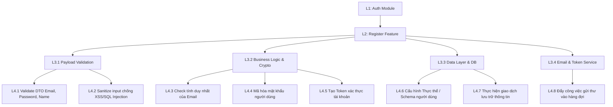
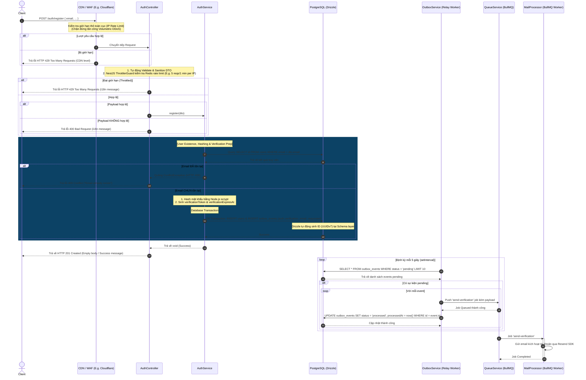

# Phân Tích & Thiết Kế Workflow: Đăng ký Người dùng (Register Flow)

Tài liệu này phân tích chi tiết thiết kế logic và luồng hoạt động của tính năng đăng ký tài khoản mới (Register Flow) thuộc Module Authentication, đảm bảo tính nhất quán dữ liệu qua cơ chế Transactional Outbox Pattern và phòng thủ nhiều lớp chống tấn công spam.

---

## Sơ Đồ Phân Rã Chức Năng (Work Breakdown Structure)



---

## 1. Chiến Lược Sử Dụng Schema Hiện Có & Bổ Sung Trường Xác Thực (Schema & Migration Strategy)

### Quyết định 1: Bổ sung trạng thái `"pending_verification"` vào Database Enum

Để đảm bảo tính tường minh về nghiệp vụ, hệ thống **bắt buộc phải chạy DB Migration** để thêm giá trị `"pending_verification"` vào kiểu enum `user_status` của PostgreSQL.

- Một tài khoản mới đăng ký sẽ được khởi tạo với trạng thái mặc định là `"pending_verification"`.
- Khi người dùng hoàn thành xác thực email, trạng thái này sẽ chuyển thành `"active"`.
- **Thay đổi cột Default:** Giá trị mặc định của cột `status` trong định nghĩa bảng `users` (tại `auth.schema.ts`) sẽ được cập nhật từ `.default("active")` thành `.default("pending_verification")`.

> ⚠️ **Lưu ý triển khai DB Migration (PostgreSQL Enum Constraint):**
> Lệnh `ALTER TYPE ... ADD VALUE` trong PostgreSQL là không thể đảo ngược (cannot be rolled back) trong một khối giao dịch (transaction block). Drizzle Kit sẽ tự động sinh file migration này với tùy chọn tắt transaction (`pgRollbackDisabled` hoặc chạy ngoài transaction block). Lập trình viên cần lưu ý điều này khi deploy trên môi trường Production để tránh xung đột lock hoặc lỗi deploy do pipeline tự động rollback.

### Quyết định 2: Bổ sung các trường phục vụ xác thực & Tối ưu hóa Partial Index

Để hỗ trợ luồng gửi mã xác nhận/OTP và dọn dẹp các tài khoản rác hết hạn, bảng `users` được bổ sung các trường và index sau:

1. **`verificationToken` (`varchar(255)`)**: Lưu token xác thực hoặc OTP code (ở dạng plain text hoặc hashed). Đi kèm một **Unique Index** để tối ưu hóa việc tìm kiếm người dùng kích hoạt tài khoản với độ phức tạp $O(1)$.
2. **`verificationExpiresAt` (`timestamp with time zone`)**: Lưu thời gian hết hạn của token/OTP.
3. **Tối ưu hóa bằng Partial Index (Chỉ mục một phần):** Thay vì đánh index toàn bộ bảng cho trường `verificationExpiresAt` (gây phình to kích thước index và giảm hiệu năng ghi), ta sử dụng một **Partial Index** lọc theo điều kiện:

   ```sql
   CREATE INDEX users_verification_expires_at_idx
     ON users (verification_expires_at)
     WHERE status = 'pending_verification';
   ```

   **Lý do chọn:** Tác vụ quét dọn dẹp tài khoản hết hạn (Cronjob) chỉ cần lọc những user có trạng thái `"pending_verification"`. Khi user kích hoạt thành công (status chuyển sang `"active"`), bản ghi của họ sẽ tự động được gỡ khỏi index này. Do đó, kích thước index luôn ở mức tối thiểu (gần như bằng 0) giúp tối ưu hóa dung lượng đĩa và tốc độ ghi của bảng `users`.

### Quyết định 3: Tự động sinh UUIDv7 ở mức Schema

Trường `id` (khóa chính) của bảng `users` được cấu hình tự động sinh thông qua hàm `$defaultFn(uuidv7)` của Drizzle ORM trong file schema:

```typescript
export const primaryKeyUuid = {
  id: uuid().primaryKey().$defaultFn(uuidv7),
};
```

Do đó, **lớp Business Logic (NestJS AuthService) hoàn toàn không cần can tiệp hay khởi tạo UUID thủ công**. Drizzle ORM sẽ tự động xử lý khi thực hiện lệnh `insert`.

### Quyết định 4: Trả về kết quả tối giản (`void`) khi đăng ký thành công

Vì lý do bảo mật và tối ưu hóa payload truyền tải qua mạng:

- API Đăng ký khi thành công sẽ không trả về toàn bộ thông tin User thực thể.
- Phản hồi từ `AuthService.register` sẽ là `void` (hoặc một DTO trống biểu thị thành công).
- HTTP Status trả về cho Client là `201 Created` kèm theo thông báo trạng thái chung.

## Quyết định 5: Triển khai Transactional Outbox Pattern cho các tác vụ phi tập trung (Đã hiện thực)

Để giải quyết vấn đề bất đồng bộ giữa việc cập nhật cơ sở dữ liệu và phát tán sự kiện (Dual-Write problem) nhằm đảm bảo tính nhất quán tuyệt đối (Atomic), hệ thống đã triển khai **Transactional Outbox Pattern**:

- **Hiện trạng thực tế:** Quá trình tạo User và tạo bản ghi sự kiện kích hoạt email (`auth.verification_email_requested`) được thực thi đồng thời trong một giao dịch DB duy nhất (Single Database Transaction).
- **Relay Worker (Đã hoàn thiện):** Một background service chạy ngầm (`OutboxService`) được kích hoạt trong vòng đời NestJS (`onApplicationBootstrap`). Worker này định kỳ quét bảng `outbox_events` tìm các bản ghi có trạng thái `'pending'` để đẩy vào hàng đợi BullMQ tương ứng, sau đó cập nhật trạng thái sự kiện thành `'processed'` (hoặc `'failed'` nếu BullMQ gặp sự cố), giúp giải phóng hoàn toàn `AuthService` khỏi sự phụ thuộc trực tiếp vào BullMQ.

---

## 2. Sơ đồ Workflow Đăng Ký Người Dùng (Register Flow)

Dưới đây là sơ đồ tuần tự xử lý yêu cầu đăng ký người dùng:



---

## 3. Chi Tiết Các Bước Nghiệp Vụ Trong Luồng Register

### Bước 1: Validate & Sanitize Payload (Lớp Controller & DTO)

- **Sanitize HTML/CSS:** Sử dụng decorator `@Transform(({ value }) => sanitizeString(value))` trên các trường `email`, `fullName`, `phoneNumber` để loại bỏ các thẻ HTML nguy hại, phòng chống XSS injection.
- **Validation Constraints:**
  - `email`: Phải đúng định dạng email tiêu chuẩn.
  - `fullName`: Không được để trống.
  - `phoneNumber`: Bắt buộc là chuỗi số có độ dài 10 chữ số, bắt đầu bằng các đầu số di động Việt Nam hợp lệ (`03`, `05`, `07`, `08`, `09`).
  - `password`: Tối thiểu 8 ký tự, chứa ít nhất 1 chữ hoa và 1 chữ số.
  - `confirmPassword`: Phải trùng khớp hoàn toàn với `password` thông qua Custom Decorator `@Match("password")`.
  - `agreeTerms`: Bắt buộc phải bằng `true`.

### Bước 2: Kiểm Tra Sự Tồn Tại Của Email (User Existence Check)

- Truy vấn trực tiếp vào database với điều kiện lọc theo trường `email`.
- **Performance:** Trường `email` trong bảng `users` được đánh chỉ mục Unique (`users_email_uidx`), đảm bảo thời gian tìm kiếm tối ưu $O(1)$ trong B-Tree Index.
- **Xử lý ngoại lệ:** Nếu tìm thấy bản ghi có email tương ứng $\rightarrow$ Ném ra `ConflictException` (NestJS built-in) để chuyển đổi thành HTTP status `409 Conflict`. Điều này ngăn chặn việc đăng ký trùng lặp tài khoản.

### Bước 3: Mã Hóa Mật Khẩu (Password Hashing)

- Khi email hợp lệ, sử dụng thuật toán băm `scrypt` (thư viện `crypto` tích hợp sẵn của Node.js) để băm mật khẩu của người dùng.
- Không bao giờ lưu trữ mật khẩu dưới dạng văn bản thuần (plain text).

### Bước 4: Lưu Trữ Người Dùng Mới (User Creation Logic)

- **Khóa chính UUIDv7:** Tự động sinh ở DB/Drizzle schema layer. `AuthService` không khởi tạo trường `id` trong code.
- **Tích Hợp Một Lần Ghi (Single DB Write):** Để tránh việc thực hiện 2 round-trip tới DB (chèn mới rồi cập nhật token), `AuthService` sẽ sinh mã xác thực `verificationToken` và thời hạn `verificationExpiresAt` ngay trong bộ nhớ và thực hiện chèn đồng thời tất cả các thông tin này trong duy nhất một lệnh `INSERT`.
- **Trạng thái & Quyền mặc định (Database-level Defaults):** Trường `status` và `role` không cần truyền thủ công từ NestJS Application. Khi lưu xuống, Database Engine của PostgreSQL sẽ tự động áp dụng các giá trị mặc định được cấu hình tại Schema Layer (`status: "pending_verification"`, `role: "user"`).
- Thực hiện lưu trữ bản ghi vào bảng `users`.

### Bước 5: Kích Hoạt Luồng Xác Thực Email (Email Verification Queue & Outbox Strategy)

- **Cơ chế ghi Outbox Event (Transactional Outbox):**
  Để giải quyết triệt để nguy cơ mất mát dữ liệu hoặc bất nhất dữ liệu giữa DB và hàng đợi (ví dụ: DB ghi thành công nhưng BullMQ sập hoặc ngược lại), luồng đăng ký thực hiện lưu trữ sự kiện kích hoạt email (`auth.verification_email_requested`) vào bảng `outbox_events` (định nghĩa trong `src/database/schemas/payments.schema.ts`) dưới dạng một event có trạng thái `pending`.
- **Database Transaction:** Bước tạo User (users table) và ghi sự kiện Outbox (outbox_events table) được gộp chung vào một transaction duy nhất. Nếu một trong hai bước lỗi, toàn bộ thao tác sẽ được rollback an toàn.
- **Cơ chế phát tán tự động (Outbox Relay Worker):**
  Một background service chạy ngầm `OutboxService` định kỳ mỗi 5 giây (sử dụng `setInterval` an toàn và tự hủy khi nhận tín hiệu graceful shutdown) sẽ truy vấn các bản ghi ở trạng thái `'pending'`. Với mỗi bản ghi, service sẽ phát tán sự kiện bằng cách đẩy tác vụ gửi email vào hàng đợi BullMQ, sau đó đánh dấu sự kiện là `'processed'`. Nếu có lỗi xảy ra, sự kiện được đánh dấu là `'failed'` để hỗ trợ theo dõi và retry thủ công/tự động.

## 4. Giải Pháp Phòng Thủ Toàn Diện Chuẩn Công Nghiệp (Defense in Depth)

Hệ thống triển khai mô hình bảo vệ 3 lớp để chống lại spam và brute-force phân tán (botnet) tại các API nhạy cảm (Đăng ký, Đăng nhập):

### Lớp 1: CDN / Gateway / Reverse Proxy (Cloudflare / NGINX / Caddy)

- **Mục tiêu:** Chặn đứng các cuộc tấn công DDoS dạng băng thông (Volumetric DDoS) và spam thô từ một lượng IP giới hạn trước khi chạm tới Node.js server.
- **Cơ chế:** Giới hạn IP ở mức thô toàn hệ thống (ví dụ: tối đa 100 requests/phút) và sử dụng JavaScript Challenge ngầm để xác thực trình duyệt thật.

### Lớp 2: Application / Business Logic (NestJS ThrottlerGuard + Redis Store)

- **Mục tiêu:** Giới hạn IP ở mức độ kiểm soát chính (Primary Tracker) trên từng endpoint để bảo vệ tài nguyên máy chủ (đặc biệt là CPU khi chạy các thuật toán băm mật khẩu scrypt nặng).
- **Ngăn ngừa rủi ro DoS bảo mật:**
  - **IP-based cho Register:** Không áp dụng chặn theo Email đối với đăng ký nhằm tránh lỗi **Account Pre-emption DoS** (kẻ xấu đăng ký ảo liên tục bằng email nạn nhân để khóa không cho tạo tài khoản thật).
  - **IP-based cho Login (Mặc định):** Không chặn cứng 429 theo Email đơn lẻ để tránh lỗi **Account Lockout DoS** (kẻ xấu spam login sai một email để khóa tài khoản của người dùng hợp lệ).
- **Cơ chế hoạt động:**
  - Đăng ký & Đăng nhập: Tối đa 5 lần yêu cầu/phút trên mỗi IP.
  - Làm mới Token: Tối đa 10 lần yêu cầu/phút trên mỗi IP.

### Lớp 3: Gia Tăng Rào Cản Bảo Mật (Progressive Friction)

- **Mục tiêu:** Ngăn chặn các cuộc tấn công Brute-force phân tán (Credential Stuffing sử dụng hàng ngàn proxy IP khác nhau để dò mật khẩu của một tài khoản).
- **Cơ chế hoạt động (Mở rộng trong tương lai):**
  - Đếm số lần đăng nhập sai của một **Email** cụ thể trên Redis.
  - Khi vượt ngưỡng giới hạn mềm (ví dụ: 5 lần đăng nhập sai/15 phút), hệ thống **không khóa tài khoản** mà kích hoạt cơ chế tăng ma sát:
    - Bắt buộc giải **Invisible CAPTCHA (Cloudflare Turnstile / reCAPTCHA v3)**.
    - Kích hoạt **Trì hoãn lũy tiến (Progressive Delay / Exponential Backoff)**: Giữ kết nối phản hồi trễ tăng dần (từ 1s lên 5s, 10s) để giảm thiểu tốc độ quét của bot tự động mà không khóa nhầm người dùng.

---

## 5. Kế Hoạch Hiện Thực Hóa (Implementation Checklist)

Hệ thống đã triển khai hoàn tất các hạng mục kỹ thuật sau:

1. **Thực hiện DB Migration (Bắt buộc):**
   - [x] Cập nhật enum `userStatusEnum` trong `src/database/schemas/enums.schema.ts` để bổ sung giá trị `"pending_verification"`.
   - [x] Cập nhật bảng `users` trong `src/database/schemas/auth.schema.ts`:
     - Thay đổi giá trị mặc định của trường `status` từ `.default("active")` thành `.default("pending_verification")`.
     - Bổ sung trường `verificationToken: varchar({ length: 255 })` (nullable).
     - Bổ sung trường `verificationExpiresAt: timestamp({ withTimezone: true, mode: "date" })` (nullable).
   - [x] Chạy `bun run db:generate` để Drizzle Kit tự động sinh file migration SQL chỉnh sửa enum (không chạy trong transaction block) và cấu trúc bảng `users`.
   - [x] Chạy `bun run db:migrate` để áp dụng file migration SQL lên Database.
2. **Triển khai hàm kiểm tra và thêm mới trong `AuthService`:**
   - [x] Inject kết nối DB Drizzle vào Service.
   - [x] Viết logic tìm kiếm user theo email bằng Drizzle query builder.
   - [x] Thêm điều kiện quăng lỗi `ConflictException` nếu user tồn tại.
   - [x] Gọi hàm băm mật khẩu và thực hiện chèn dữ liệu mới vào DB.
3. **Cập nhật `RegisterDto` & Viết Unit Test/Integration Test:**
   - [x] Kiểm chứng các test cases đăng ký thành công.
   - [x] Kiểm chứng test cases đăng ký trùng email (trả về lỗi 409).
4. **Cấu hình Rate Limiting (Mở rộng bảo mật):**
   - [x] Cài đặt `@nestjs/throttler` và `@nest-lab/throttler-storage-redis`.
   - [x] Đăng ký `ThrottlerModule` và cấu hình các chỉ số giới hạn mặc định.
   - [x] Kích hoạt `ThrottlerGuard` tại `AuthController` và tùy biến lỗi dịch thuật i18n phù hợp.
