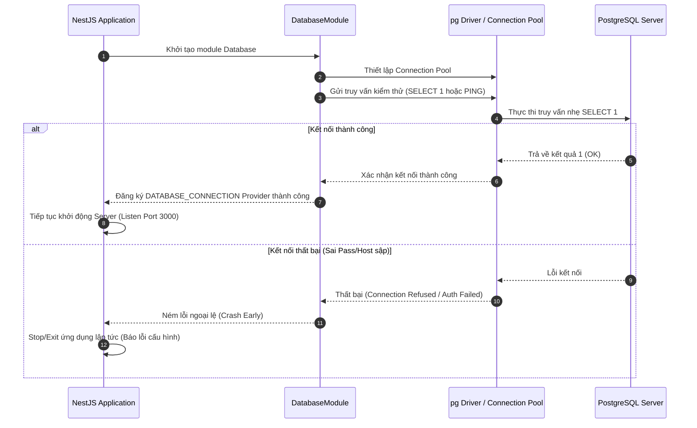

# Khái Niệm Entity và Kiểm Thử Kết Nối Database trong Drizzle ORM

## TL;DR

Tài liệu này giải thích chi tiết khái niệm **Entity (Thực thể)** trong ngữ cảnh của Drizzle ORM (được sử dụng trong dự án này) và cách hệ thống thực hiện **Kiểm thử kết nối Database (Database Connection Testing)** nhằm đảm bảo độ tin cậy khi ứng dụng khởi chạy.

---

## 1. Khái Niệm Entity (Thực thể) Là Gì?

Trong lập trình với các hệ quản trị cơ sở dữ liệu quan hệ (RDBMS), **Entity (Thực thể)** đại diện cho cấu trúc của một bảng (table) dữ liệu dưới dạng mã nguồn (Code). Nó là cầu nối giúp mã nguồn TypeScript hiểu được cấu trúc của cơ sở dữ liệu mà không cần viết các câu lệnh SQL tạo bảng thủ công.

### Sự khác biệt giữa các ORM

- **Kiểu truyền thống (TypeORM, Hibernate):** Sử dụng các Class và Class Decorator (ví dụ: `@Entity()`, `@Column()`).
- **Kiểu Drizzle ORM (Dự án của chúng ta):** Drizzle tiếp cận theo dạng khai báo hướng dữ liệu (Data-driven/TypeScript-first). Ở đây, Entity **không phải là class**, mà là các **đối tượng TypeScript (Objects)** đại diện cho các bảng, được định nghĩa bằng hàm `pgTable` (hoặc hàm helper `snakeCase.table` trong codebase).

### Ví dụ về Entity `users` trong codebase (`src/database/schemas/auth.schema.ts`)

```typescript
import { varchar, text } from "drizzle-orm/pg-core";
import { snakeCase } from "drizzle-orm/pg-core";
import { baseEntity } from "./helpers.schema";

export const users = snakeCase.table(
  "users", // Tên bảng thực tế trong PostgreSQL
  {
    ...baseEntity, // Tự động kế thừa id (uuidv7), createdAt, và updatedAt
    email: varchar({ length: 255 }).notNull(),
    name: varchar({ length: 255 }).notNull(),
    phoneNumber: varchar({ length: 20 }),
    passwordHash: text(),
  },
);
```

#### Tại sao Entity lại quan trọng trong Drizzle?

1. **Định nghĩa Cấu trúc Bảng:** Drizzle Kit sẽ đọc các Entity này để tự động tạo ra các tệp Migration SQL (`drizzle-kit generate`) để cập nhật Cấu trúc CSDL PostgreSQL.
2. **Tự động suy luận kiểu dữ liệu (Type Inference):** Thay vì phải viết thủ công một Interface/Type trùng lặp cho User, bạn có thể tự động lấy ra kiểu dữ liệu thông qua Entity:

   ```typescript
   import { type InferSelectModel, type InferInsertModel } from "drizzle-orm";

   // Kiểu dữ liệu nhận được khi SELECT từ DB
   export type User = InferSelectModel<typeof users>;

   // Kiểu dữ liệu cần thiết khi INSERT vào DB
   export type NewUser = InferInsertModel<typeof users>;
   ```

---

## 2. Kiểm Thử Kết Nối Database (Database Connection Testing) Là Gì?

Khi ứng dụng NestJS khởi động, việc đầu tiên nó cần làm là thiết lập kết nối tới cơ sở dữ liệu PostgreSQL. **Kiểm thử kết nối Database** là quá trình chạy một câu lệnh truy vấn giả lập siêu nhẹ để kiểm tra xem:

1. Cơ sở dữ liệu PostgreSQL có đang hoạt động hay không (Database Server is Up).
2. Thông tin cấu hình kết nối (Host, Port, Username, Password, Database Name) truyền từ biến môi trường (`.env` hoặc `doppler`) có chính xác hay không.

### Cách thức hoạt động trong dự án

Trong `DatabaseModule` (`src/database/database.module.ts`), một Client kết nối được khởi tạo (thông qua driver `pg` hoặc `postgres`).



### Tại sao phải thực hiện kiểm thử kết nối khi khởi chạy?

- **Thất bại sớm (Fail-Fast):** Tránh trường hợp ứng dụng NestJS khởi động thành công và hiển thị cổng 3000, nhưng khi người dùng gửi request đăng nhập/đăng ký thì ứng dụng mới báo lỗi sập CSDL. Kiểm thử kết nối giúp phát hiện lỗi cấu hình môi trường ngay lập tức khi ứng dụng vừa khởi chạy.

---

## Related Notes & MOC Backlinks

- Thư mục MOC: [[000_Ticket_Booking_MOC]]
- Quy chuẩn lập trình Drizzle ORM: [[Drizzle_v1_RC4_Coding_Standards]]
- Sơ đồ Cơ sở dữ liệu: [[Database_Schema.dbml]]
- Kiểm định Index CSDL: [[Database_Index_Audit]]
