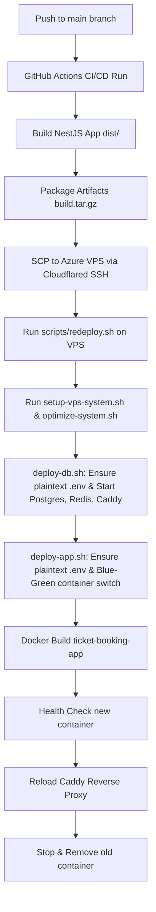
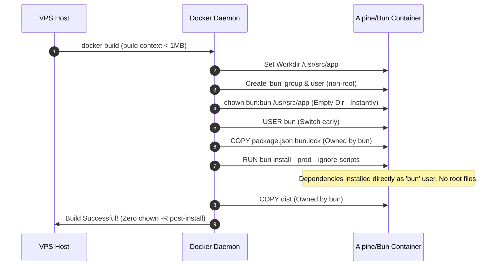
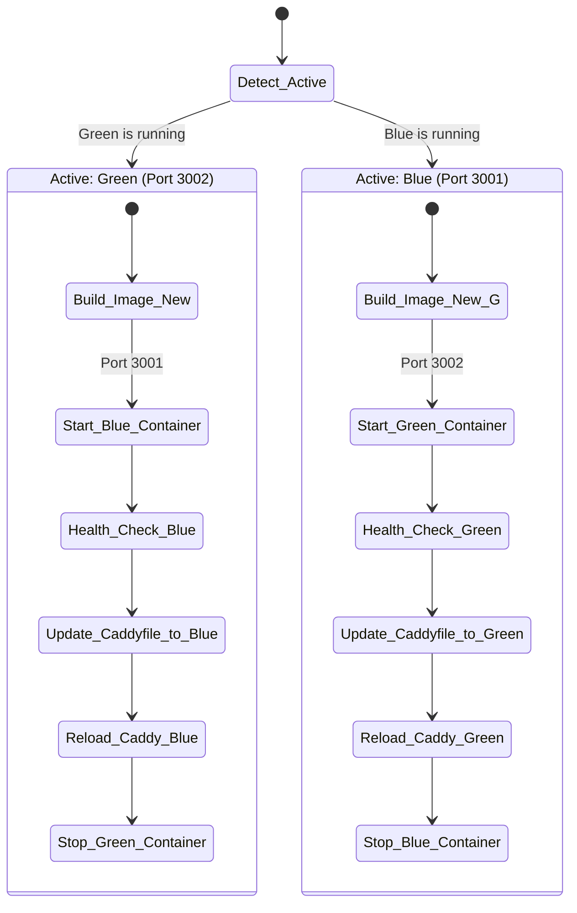
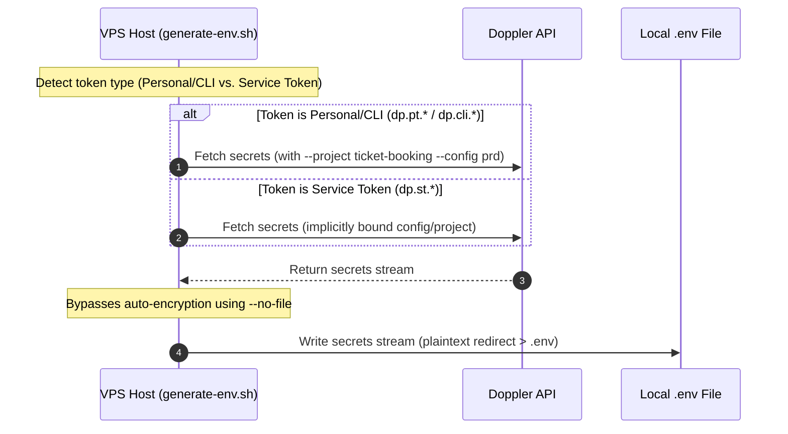

# Docker Blue-Green Deployment Workflow (Azure VPS)

This document details the CI/CD pipeline, system configurations, and zero-downtime deployment flow for the Ticket Booking NestJS application on the resource-constrained Azure VM.

## Workflow Overview



---

## 1. System Memory Optimization & Limits

The Azure VPS is a low-resource machine with **~852MB RAM** and **2GB configured swap space**.

### The Docker Daemon Limit Issue

Previously, a hard memory limit of `MemoryMax=250M` was set on the `docker.service` slice in systemd to prevent container leaks. However, because systemd groups the Docker daemon and all its child containers (Postgres, Redis, Caddy, NestJS app, and temporary build containers) under the same slice:

- The total memory limit of 250MB was quickly exceeded.
- This triggered aggressive kernel cgroups throttling and extreme swap thrashing during `docker build` (specifically during file I/O operations like `chown` or package installation).
- It resulted in build times stretching to over 15 minutes or completely hanging the CPU.

### Resolution

The memory limits have been completely removed from `docker.service`.

- **Location**: `/etc/systemd/system/docker.service.d/memory.conf` (Deleted).
- **Behavior**: The Docker daemon and containers can now utilize the entire 850MB RAM + 2GB swap space. The Linux kernel handles swapping dynamically, eliminating the I/O bottleneck during builds.

---

## 2. Optimized Docker Build Pattern

We run `docker build` directly on the VPS to avoid loading large pre-built image tarballs (`docker load`), which can cause OOM crashes due to the large memory buffer required for Gzip extraction in only 50MB of free RAM.



### Key Performance Optimizations

1. **Context Size < 1MB**: We exclude `node_modules` from the build context by copying `Dockerfile.prod.dockerignore` to `.dockerignore` at build time. Only `dist/` and configuration files are sent to the Docker daemon.
2. **Early Non-Root Switch**: We switch to `USER bun` _before_ copying files and running `bun install`.
3. **Elimination of `chown -R`**: Because all files are copied and created under `USER bun`, we do not need to run `chown -R bun:bun /usr/src/app` (which takes minutes to rewrite permissions of 15,000+ files in `node_modules`).
4. **Caching**: Docker caches the `bun install` layer unless `package.json` or `bun.lock` changes, making subsequent builds complete in under 5 seconds.
5. **No Husky in Prod**: Added `--ignore-scripts` to bypass the `husky prepare` lifecycle hook since `devDependencies` are not present in production.

---

## 3. Blue-Green Zero-Downtime Switching

The `deploy-app.sh` script manages the active application namespace dynamically.



### Step-by-Step Flow

1. **Namespace Detection**: Checks if the container named `ticket-booking-app-blue` or `ticket-booking-app-green` is currently active.
2. **Launch Target**: Starts the opposite container (e.g. if Blue is running, starts Green).
3. **Health Probe**: Runs up to 15 HTTP requests to `http://localhost:<port>/` to verify NestJS has completed bootstrapping.
4. **Hot Reload Proxy**: Overwrites `Caddyfile` with the IP and port of the newly verified healthy container, and instantly runs `caddy reload` (takes < 50ms, zero-downtime).
5. **Clean Up**: Stops and removes the old container, then runs `docker image prune` to keep disk usage minimal.

---

## 4. Doppler Configuration & Plaintext Env Generation

The `scripts/generate-env.sh` script downloads the latest environment variables from Doppler on the VPS during redeployment.



### Doppler Local Filesystem Encryption Behavior

By default, when running `doppler secrets download <filepath>`, Doppler CLI automatically **encrypts the file on disk** using a passphrase computed from the active configuration. The resulting file starts with a signature like `4:base64:500000:` (which is a salt-and-IV-prefixed PBKDF2 symmetric encryption wrapper).

- **The Problem**: Node.js and NestJS's environment parsers (`dotenv` / `@t3-oss/env-core`) expect a standard plaintext `.env` file and cannot read this encrypted content, leading to missing environment variables and connecting to fallback defaults (like `localhost:6379`).
- **The Resolution**: We bypass this automatic filesystem encryption by telling Doppler to output to stdout using the `--no-file` flag and redirecting the output to `.env`:

  ```bash
  doppler secrets download $CONFIG_FLAG --format=env --no-file > "$ENV_FILE"
  ```

### Config Resolution & Token Types

Doppler CLI resolves the active project and environment configuration based on the type of `DOPPLER_TOKEN` configured in GitHub Secrets:

1. **Personal / CLI Tokens (`dp.pt.xxx` / `dp.cli.xxx`)**:
   - Because `doppler.yaml` (which defaults to `dev`) is not packaged or uploaded to the VPS to keep the build context small, Doppler CLI on the VPS will fail with `Active configuration is not set` if run without flags.
   - To resolve this, `generate-env.sh` checks the token prefix and automatically appends project and config parameters:

     ```bash
     CONFIG_FLAG="--project ticket-booking --config ${DOPPLER_CONFIG:-prd}"
     ```

2. **Service Tokens (`dp.st.xxx`)**:
   - Service tokens are **hard-locked** to the specific Doppler project and config environment (e.g. `dev`, `stg`, or `prd`) they were created for.
   - Because they are locked, they cannot accept CLI flags like `--config`. The script automatically detects the `dp.st.` prefix and omits the flags to prevent CLI validation errors.
   - **Important Security Note**: If the deployment is fetching incorrect variables, verify that the `DOPPLER_TOKEN` in GitHub Secrets is a Service Token specifically generated for the **Production (`prd`)** configuration.
