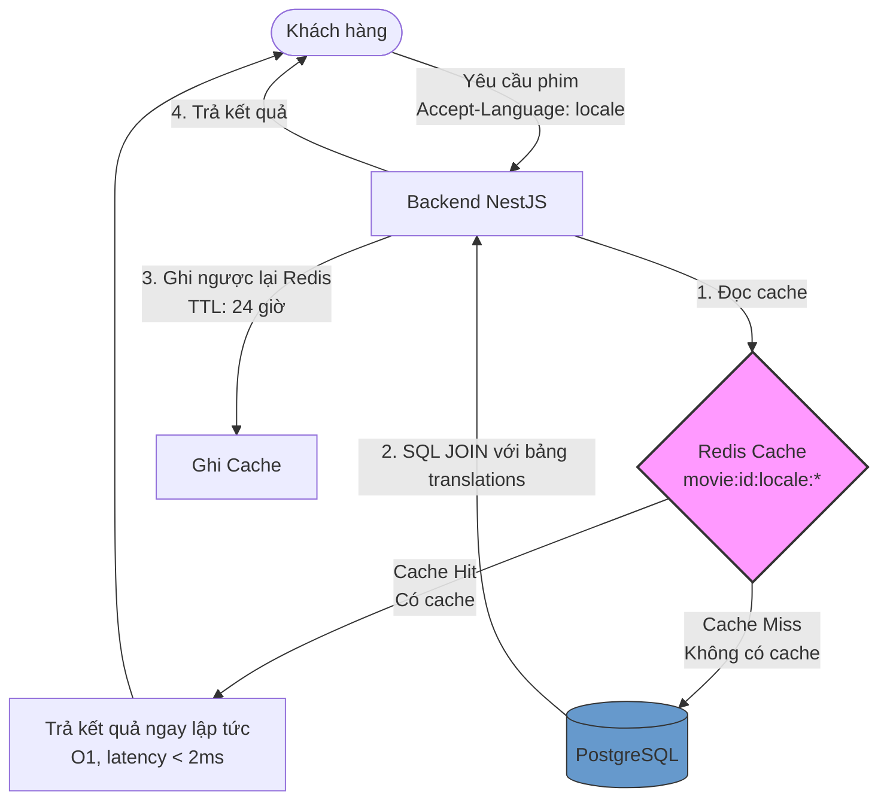
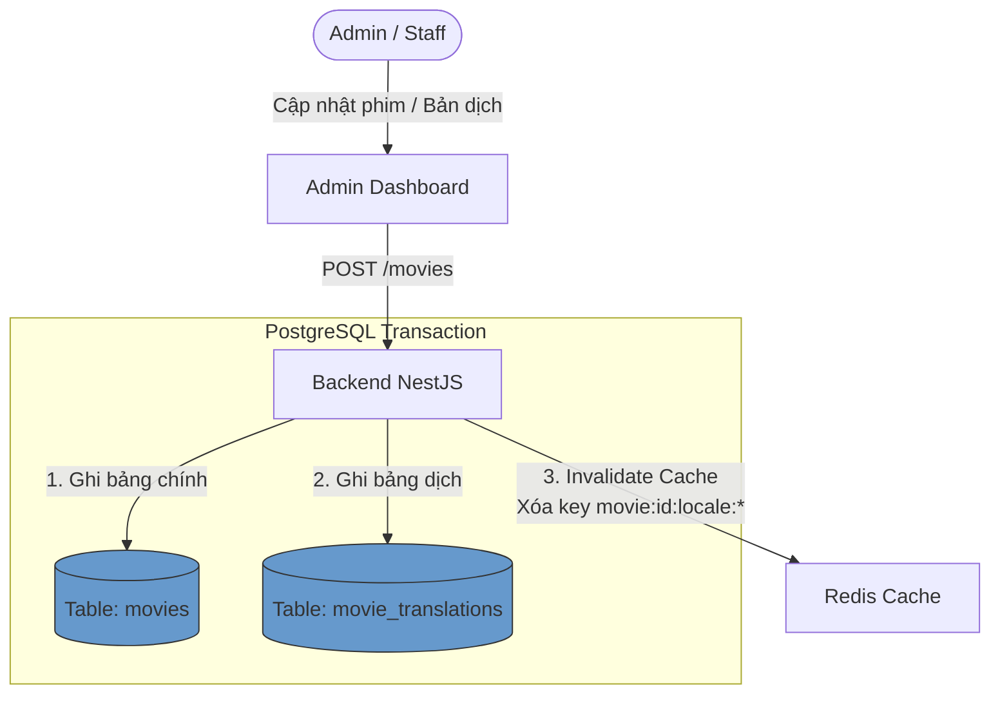

# 🌐 Chiến Lược Dịch Thuật & Caching CSDL Suất Chiếu Tải Cao

## TL;DR

Tài liệu này trình bày giải pháp kết hợp giữa **Mô hình Dịch Thuật Chuẩn Hóa (Translation Tables)** trong CSDL vật lý và **Lớp Caching (Redis)** ở tầng ứng dụng, giúp giải quyết triệt để bài toán đa ngôn ngữ (Việt - Anh) mà không làm suy giảm hiệu năng truy vấn đặt vé dưới tải cao (concurrency).

---

## Core Concept & Rationale

Trong một hệ thống đặt vé phim tải cao (Flash Sale), nghiệp vụ đọc (lấy danh sách phim, suất chiếu) chiếm ~95% traffic, trong khi nghiệp vụ ghi (cập nhật thông tin phim) cực kỳ hiếm khi xảy ra.

Nếu ta tách bản dịch ra bảng phụ (`movie_translations`) để chuẩn hóa CSDL theo chuẩn quan hệ:

- **Thách thức:** Mỗi câu truy vấn đọc thông tin phim ở trang chủ sẽ phải gánh thêm chi phí phép `SQL JOIN` với bảng dịch, làm tăng độ trễ (latency) và tiêu tốn CPU của Database dưới tải lớn.
- **Giải pháp:** Sử dụng **Redis Caching** làm lớp lá chắn trước Database. Toàn bộ bản dịch theo từng ngôn ngữ của bộ phim sẽ được cache dưới dạng các key độc lập (ví dụ: `movie:<id>:locale:vi`).

Lớp Cache sẽ chịu toàn bộ tải đọc từ client. Database PostgreSQL chỉ được truy cập khi xảy ra **Cache Miss** hoặc khi người dùng thực hiện **đặt chỗ thanh toán** (vốn là nghiệp vụ quan trọng nhất cần ACID).

---

### 1. Luồng Hoạt Động Của Hệ Thống (Read/Write Flow với Cache)

Vì hệ thống của chúng ta **đã cấu hình sẵn Redis** (đang dùng cho Redlock và BullMQ), việc tận dụng nó để làm tầng Cache cho danh mục phim là cực kỳ tự nhiên và tối ưu.

#### 1.1 Sơ đồ trực quan (Mermaid Diagrams)

##### Luồng Đọc (Read Path)



1. Người dùng gọi API lấy danh sách phim bằng ngôn ngữ Tiếng Việt (Accept-Language: vi).
2. Backend NestJS kiểm tra khóa trong Redis, ví dụ: movie:<id>:locale:vi.
   - Nếu có (Cache Hit): Trả về dữ liệu ngay lập tức (O(1) độ trễ < 2ms). Hệ thống không cần động vào PostgreSQL.
   - Nếu không có (Cache Miss): Backend thực hiện lệnh SQL JOIN giữa bảng movies và movie_translations với điều kiện language_code = 'vi'. Sau khi có dữ liệu từ DB, lưu ngược lại vào Redis với thời gian hết hạn (TTL - ví dụ: 24 giờ), rồi trả về cho client.

##### Luồng Ghi (Write Path)



1. Admin cập nhật thông tin dịch thuật của phim qua Dashboard.
2. Backend thực thi một DB Transaction cập nhật song song cả bảng movies và movie_translations (để đảm bảo tính toàn vẹn dữ liệu).
3. Invalidate Cache (Xóa Cache): Backend chủ động xóa key movie:<id>:locale:\* trong Redis. Lần truy cập tiếp theo của người dùng sẽ bị Cache Miss và tự động nạp lại dữ liệu mới nhất từ DB.

---

### 2. Ưu điểm & Đánh đổi (Trade-offs)

#### Ưu điểm lớn

- Database được bảo vệ tuyệt đối: PostgreSQL không phải gánh các câu lệnh JOIN dịch thuật từ hàng triệu người dùng duyệt phim ở trang chủ. DB chỉ phải chịu tải khi người dùng thực hiện thao tác Đặt vé (vốn là nghiệp vụ quan trọng nhất cần ACID).
- Thiết kế CSDL chuẩn hóa: Bảng movies không bị phình to bởi các trường JSONB. Việc quản lý ngôn ngữ mới chỉ đơn giản là chèn dòng mới vào bảng movie_translations.

#### Đánh đổi & Thách thức (Tăng độ phức tạp của code)

1. Tính nhất quán dữ liệu (Cache Consistency):
   - Nếu Admin cập nhật thông tin trong DB thành công nhưng bước xóa cache Redis bị thất bại (mạng chập chờn), người dùng sẽ tiếp tục nhìn thấy thông tin dịch thuật cũ cho đến khi cache hết hạn (TTL).
   - Khắc phục: Đặt TTL cho cache không quá dài (khoảng 1-2 tiếng) hoặc sử dụng cơ chế Write-through Cache.
2. Quản lý bộ nhớ Redis (Cache Eviction):
   - Nếu rạp có hàng nghìn bộ phim, việc lưu trữ tất cả bản dịch trong bộ nhớ RAM của Redis có thể làm tăng chi phí hạ tầng.
   - Khắc phục: Sử dụng chính sách allkeys-lru (Least Recently Used) trong cấu hình Redis để tự động loại bỏ các phim cũ ít người xem ra khỏi cache khi bộ nhớ đầy.

---

## Code Implementation Snippets

### 1. Cấu trúc CSDL vật lý (PostgreSQL)

Mô hình tách biệt dữ liệu kỹ thuật tĩnh (`movies`) và dữ liệu dịch thuật động (`movie_translations`):

```sql
CREATE TABLE movies (
  id UUID PRIMARY KEY,
  tmdb_id VARCHAR(50) UNIQUE,
  imdb_id VARCHAR(50) UNIQUE,
  duration_minutes INTEGER NOT NULL,
  release_date DATE,
  poster_url TEXT,
  trailer_url TEXT,
  rating VARCHAR(10),
  created_at TIMESTAMP DEFAULT now() NOT NULL,
  updated_at TIMESTAMP DEFAULT now() NOT NULL
);

CREATE TABLE movie_translations (
  movie_id UUID REFERENCES movies(id) ON DELETE CASCADE,
  language_code VARCHAR(10) NOT NULL, -- 'vi', 'en',...
  title VARCHAR(255) NOT NULL,
  description TEXT,
  PRIMARY KEY (movie_id, language_code)
);
```

### 2. Luồng Đồng Bộ & Hủy Cache (Cache Invalidation)

```typescript
// Giao dịch cập nhật thông tin và bản dịch phim
async function updateMovie(movieId: string, updateData: UpdateMovieDto) {
  await db.transaction(async (tx) => {
    // 1. Cập nhật bảng chính movies
    await tx
      .update(movies)
      .set(updateData.technicalData)
      .where(eq(movies.id, movieId));

    // 2. Cập nhật bảng bản dịch movie_translations
    await tx
      .insert(movie_translations)
      .values(updateData.translations)
      .onConflictDoUpdate({
        target: [movie_translations.movieId, movie_translations.languageCode],
        set: {
          title: updateData.translations.title,
          description: updateData.translations.description,
        },
      });
  });

  // 3. Xóa cache trong Redis để buộc lần đọc tiếp theo nạp lại dữ liệu mới
  const locales = ["vi", "en"];
  for (const locale of locales) {
    await redis.del(`movie:${movieId}:locale:${locale}`);
  }
}
```

### 3. Đọc dữ liệu qua Redis Cache (Cache Aside)

```typescript
async function getMovieDetails(movieId: string, locale: string) {
  const cacheKey = `movie:${movieId}:locale:${locale}`;

  // 1. Kiểm tra trong Redis cache
  const cachedData = await redis.get(cacheKey);
  if (cachedData) {
    return JSON.parse(cachedData); // Trả về ngay lập tức (độ trễ < 2ms)
  }

  // 2. Cache Miss - Thực hiện SQL JOIN truy vấn DB
  const movie = await db
    .select()
    .from(movies)
    .innerJoin(movie_translations, eq(movies.id, movie_translations.movieId))
    .where(
      and(eq(movies.id, movieId), eq(movie_translations.languageCode, locale)),
    )
    .then((res) => res[0]);

  if (movie) {
    // 3. Ghi ngược lại vào Redis kèm TTL (Time-To-Live, ví dụ 2 giờ)
    await redis.set(cacheKey, JSON.stringify(movie), "EX", 7200);
  }

  return movie;
}
```

---

## Related Notes

- Bản đồ dự án (MOC): [[000_Ticket_Booking_MOC]]
- Sơ đồ cơ sở dữ liệu (DBML): [[Database_Schema.dbml]]
- Đặc tả thiết kế hệ thống: [[Architecture_and_Spec]]
- Luồng đồng bộ hóa phim TMDB: [[Movie_Sync_Workflow]]
