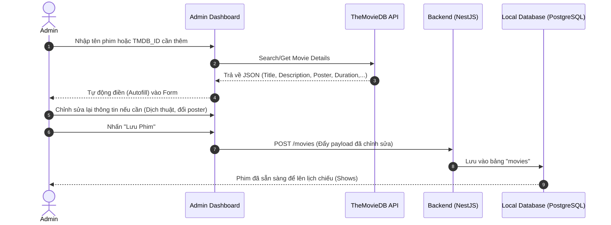

# 🎬 Luồng Tích Hợp Dữ Liệu Phim & TMDB Sync Service

## TL;DR

Quy trình mô tả cách hệ thống Admin Dashboard tương tác với TheMovieDB (TMDB) API để tự động điền (autofill) thông tin phim và lưu trữ trực tiếp xuống cơ sở dữ liệu nội bộ (PostgreSQL) thông qua NestJS Backend, giúp giảm tải thao tác thủ công cho nhân viên rạp mà vẫn giữ tính toàn vẹn dữ liệu.

---

## Core Concept & Rationale

Để tối ưu hóa hiệu năng và đảm bảo hệ thống hoạt động độc lập, dữ liệu phim được lưu trữ vật lý tại cơ sở dữ liệu nội bộ (`PostgreSQL`) thay vì gọi API trực tiếp từ TMDB mỗi khi khách hàng truy cập.

Hệ thống kết hợp cơ chế lấy dữ liệu tự động (Dynamic Pull) từ TMDB để hỗ trợ nhân viên vận hành (Admin) trong quá trình nhập liệu tại trang quản trị (Admin Dashboard).

---

## Workflow Diagrams

### 1. Mermaid Sequence Diagram

---

## Detailed Steps

1. **Yêu cầu tìm kiếm:** Admin nhập tên phim hoặc mã `TMDB_ID`/`IMDb_ID` trên giao diện Admin Dashboard.
2. **Gọi API bên ngoài:** Admin Dashboard gửi request tìm kiếm hoặc lấy chi tiết từ TheMovieDB (TMDB) API.
3. **Autofill (Điền tự động):** Các trường thông tin cơ bản của phim (Tiêu đề, mô tả, ảnh poster, trailer, thời lượng) được điền tự động vào Form nhập liệu.
4. **Hiệu chỉnh thông tin:** Nhân viên rạp (Admin) có thể chỉnh sửa lại tiêu đề, viết lại mô tả tiếng Việt (nếu bản dịch mặc định chưa mượt mà) hoặc upload ảnh poster tùy biến.
5. **Lưu trữ CSDL nội bộ:** Khi nhấn "Lưu Phim", dữ liệu được gửi về NestJS Backend thông qua REST API `POST /movies` và được lưu vật lý vào bảng `movies` của cơ sở dữ liệu PostgreSQL. Dữ liệu này sẵn sàng phục vụ việc tạo lịch chiếu (`shows`).

---

## Related Notes

- Đặc tả thiết kế hệ thống chi tiết: [[Architecture_and_Spec]]
- Sơ đồ cơ sở dữ liệu (DBML): [[Database_Schema.dbml]]
- Bản đồ dự án (MOC): [[000_Ticket_Booking_MOC]]
