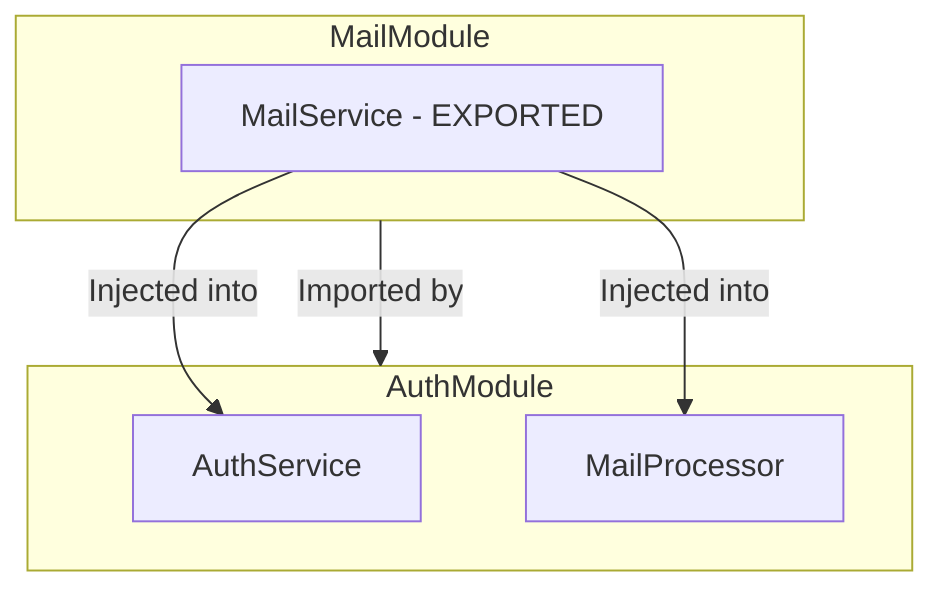

# Kiến Trúc & Cấu Trúc Module Trong NestJS

Trong NestJS, **Module** là khối xây dựng cơ bản (building block) để tổ chức cấu trúc mã nguồn. Một ứng dụng NestJS là một biểu đồ các module (Module Graph) được liên kết với nhau. Mỗi module đóng gói một nhóm chức năng logic riêng biệt (như Authentication, Mail, Database, Users).

Tài liệu này trình bày chi tiết về cấu trúc, cách hoạt động, quy tắc bao đóng và cách tổ chức thư mục của một module chuẩn trong NestJS dựa trên thực tế dự án.

---

## 1. Decorator `@Module()` và 4 Thuộc Tính Cốt Lõi

Mỗi module trong NestJS là một class được gắn decorator `@Module()`. Decorator này nhận một đối tượng chứa metadata để NestJS cấu hình biểu đồ DI (Dependency Injection) của ứng dụng:

```typescript
@Module({
  imports: [OtherModule],
  controllers: [MyController],
  providers: [MyService],
  exports: [MyService],
})
export class MyModule {}
```

### Chi tiết các thuộc tính:

| Thuộc tính        | Định nghĩa                                                                                   | Ý nghĩa thực tế                                                                                                                                                          |
| :---------------- | :------------------------------------------------------------------------------------------- | :----------------------------------------------------------------------------------------------------------------------------------------------------------------------- |
| **`imports`**     | Danh sách các module khác mà module này cần sử dụng.                                         | Khi bạn muốn dùng một Service được export từ module khác, bạn phải import module đó tại đây.                                                                             |
| **`controllers`** | Danh sách các Controller xử lý định tuyến (Routing) của module này.                          | NestJS sẽ tự động khởi tạo các controller này và gắn kết chúng với HTTP Router tương ứng.                                                                                |
| **`providers`**   | Các class (Service, Repository, Factory, Processor) cung cấp logic nghiệp vụ.                | Các thành phần này sẽ được NestJS IoC Container quản lý và có thể nhúng (inject) lẫn nhau trong cùng một module.                                                         |
| **`exports`**     | Danh sách các **providers** hoặc **modules** mà module này muốn chia sẻ cho các module khác. | Theo mặc định, các service trong module là **Private (Bao đóng)**. Chỉ những service nằm trong mảng `exports` mới có thể sử dụng ở module khác khi họ import module này. |

---

## 2. Quy Tắc Bao Đóng (Encapsulation) & Dependency Injection

Hiểu rõ quy tắc bao đóng là chìa khóa để viết code NestJS không bị lỗi phụ thuộc.



### Kịch bản thực tế của dự án:

Dự án của chúng ta có hai module là `AuthModule` và `MailModule`.

- **MailModule**: Định nghĩa `MailService` dùng để gửi mail.
  ```typescript
  // src/modules/mail/mail.module.ts
  @Module({
    providers: [MailService],
    exports: [MailService], // Phải export thì module khác mới dùng được!
  })
  export class MailModule {}
  ```
- **AuthModule**: Muốn sử dụng `MailService` để gửi email xác thực tài khoản.
  ```typescript
  // src/modules/auth/auth.module.ts
  @Module({
    imports: [MailModule], // Bắt buộc import MailModule
    controllers: [AuthController],
    providers: [AuthService, MailProcessor],
  })
  export class AuthModule {}
  ```

### 2.1. Tính Năng Re-exporting Modules (Tái xuất khẩu Module)

Theo tài liệu chính thức từ NestJS, một module không chỉ export các Provider đơn lẻ mà còn có thể **export lại các Module khác** mà nó đã import.

- Điều này giúp tạo ra một "Cổng kết nối" (Gateway / Public API) cho một nhóm module liên quan.

```typescript
@Module({
  imports: [CommonModule],
  exports: [CommonModule], // Bất cứ module nào import module này sẽ tự động được sử dụng CommonModule mà không cần import trực tiếp nữa
})
export class CoreModule {}
```

### 2.2. Tính chất Singleton của Module

Trong NestJS, **mọi Module đều là Singletons**.

- Khi bạn import cùng một module ở nhiều nơi, NestJS chỉ khởi tạo instance của các Provider trong module đó **đúng một lần duy nhất** (singleton instance) và chia sẻ (cache) chúng giữa các module khác nhau. Điều này giúp tối ưu hóa bộ nhớ và giữ tính toàn vẹn dữ liệu (ví dụ: chia sẻ cùng một kết nối Database).

### 2.3. Dependency Injection ngay tại Module Class

Một điểm nâng cao từ NestJS Docs: Lớp cấu hình Module (Module Class) cũng có thể **inject các Provider** vào trong constructor của nó (ví dụ: phục vụ việc thiết lập cấu hình chạy ban đầu, kết nối bên ngoài...):

```typescript
@Module({
  controllers: [CatsController],
  providers: [CatsService],
})
export class CatsModule {
  constructor(private readonly catsService: CatsService) {} // Khả thi!
}
```

- _Lưu ý_: Lớp Module bản thân nó không thể được inject làm Provider cho lớp khác vì sẽ tạo ra lỗi vòng lặp phụ thuộc (Circular Dependency).

---

## 3. Cấu Trúc Thư Mục Chuẩn Của Một Module

Trong dự án thực tế, một module chức năng (Feature Module) được cấu trúc phân lớp rõ ràng để đảm bảo tính dễ đọc và bảo trì.

Dưới đây là cấu trúc thư mục của **`AuthModule`** trong dự án hiện tại của chúng ta:

```
src/modules/auth/
├── auth.module.ts            # Điểm cấu hình đầu vào của Module (Module Entry)
├── auth.controller.ts        # Tầng API/Routing: Nhận HTTP request, điều hướng nghiệp vụ
├── auth.service.ts           # Tầng Nghiệp vụ (Business Logic): Xử lý nghiệp vụ chính
├── auth.routes.ts            # Hằng số định tuyến (Route Constants) của module
├── auth.controller.spec.ts   # Unit test cho Controller
├── auth.service.spec.ts      # Unit test cho Service
│
├── dto/                      # Data Transfer Objects: Định nghĩa kiểu dữ liệu & validate đầu vào
│   ├── index.ts              # Thư mục xuất khẩu tập trung (Barrel file)
│   ├── register.dto.ts
│   ├── login.dto.ts
│   └── refresh-token.dto.ts
│
├── processors/               # Workers / Queue Processors (Xử lý tác vụ ngầm BullMQ)
│   ├── mail.processor.ts
│   └── mail.processor.spec.ts
│
└── entities/                 # Định nghĩa các schemas/models cơ sở dữ liệu riêng của module
```

---

## 4. Các Loại Module Đặc Biệt Trong NestJS

### 4.1. Global Modules (Module Toàn Cục)

Nếu bạn có một module cần được sử dụng ở **mọi nơi** trong ứng dụng (ví dụ: DatabaseModule, ConfigModule), việc phải import nó ở hàng chục module khác nhau sẽ rất phiền phức.

- Bằng cách gắn thêm decorator `@Global()`, module đó sẽ tự động khả dụng toàn cục mà không cần khai báo trong mảng `imports` của các module khác.

```typescript
@Global()
@Module({
  providers: [DatabaseService],
  exports: [DatabaseService],
})
export class DatabaseModule {}
```

> ⚠️ **Cảnh báo**: Hãy hạn chế lạm dụng `@Global()`. Chỉ nên dùng cho hạ tầng cốt lõi (Database, Config, Logger). Dùng quá nhiều sẽ phá vỡ tính bao đóng và khó kiểm soát phụ thuộc.

### 4.2. Dynamic Modules (Module Động)

Hầu hết các module là **Static Modules** (được cấu hình cứng lúc biên dịch). Tuy nhiên, đôi khi bạn cần truyền cấu hình động vào module khi import (ví dụ: truyền API Key, cấu hình Redis tùy theo môi trường).

- NestJS hỗ trợ Dynamic Module bằng cách sử dụng các phương thức tĩnh như `forRoot()` hoặc `register()`.

```typescript
// Cách import Dynamic Module trong AppModule
@Module({
  imports: [
    BullModule.forRoot({
      connection: { host: "localhost", port: 6379 },
    }),
  ],
})
export class AppModule {}
```

---

## 5. Vấn Đề Lỗi Vòng Lặp Phụ Thuộc (Circular Dependency)

Một lỗi rất phổ biến khi thiết kế module là **Circular Dependency** (A cần B, nhưng B cũng cần A).

- **Ví dụ**: `UsersModule` cần `AuthModule` để mã hóa mật khẩu, ngược lại `AuthModule` cần `UsersModule` để tìm thông tin user đăng nhập.

### Cách xử lý:

1. **Trong Module**: Sử dụng `forwardRef()` của NestJS trong mảng `imports`.
   ```typescript
   // auth.module.ts
   imports: [forwardRef(() => UsersModule)];

   // users.module.ts
   imports: [forwardRef(() => AuthModule)];
   ```
2. **Trong Service (Constructor)**: Cũng phải dùng `@Inject(forwardRef(() => Service))` tương ứng:
   ```typescript
   // auth.service.ts
   constructor(
     @Inject(forwardRef(() => UsersService))
     private readonly usersService: UsersService,
   ) {}
   ```
