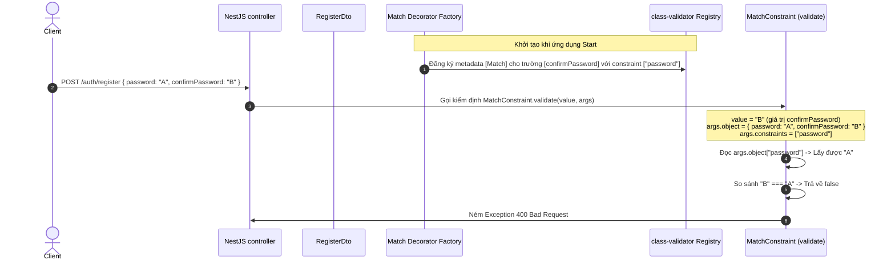

# Cơ Chế Hoạt Động Của Custom Validation Constraint Match

## TL;DR

Tài liệu này giải thích chi tiết cách hoạt động và nguồn gốc của các tham số đầu vào trong Custom Decorator `@Match` và class kiểm định `MatchConstraint` sử dụng thư viện `class-validator` trong NestJS. Cơ chế này cho phép thực hiện việc so khớp dữ liệu chéo giữa hai trường khác nhau trong cùng một đối tượng (ví dụ: `confirmPassword` phải trùng khớp với `password`).

---

## Sơ Đồ Luồng Truyền Dữ Liệu (Data Flow Diagram)



---

## Giải Thích Chi Tiết Từng Phần

### 1. Hàm Decorator Factory (`Match`)

Hàm `Match` đóng vai trò là một **Decorator Factory**. Nó được chạy một lần duy nhất lúc khởi động ứng dụng (hoặc khi file DTO được load vào bộ nhớ) để đăng ký các quy tắc validation.

```typescript
export function Match(property: string, validationOptions?: ValidationOptions) {
  return (object: object, propertyName: string) => {
    registerDecorator({
      target: object.constructor,
      propertyName,
      options: validationOptions,
      constraints: [property],
      validator: MatchConstraint,
    });
  };
}
```

#### Nguồn gốc các tham số

- **`property: string`**: Do lập trình viên truyền vào khi viết `@Match("password")` trên DTO. Đây là tên của trường dữ liệu mục tiêu muốn so khớp.
- **`validationOptions`**: Các tùy chọn bổ sung như thông báo lỗi (`message`), nhóm validation (`groups`), v.v.
- **`object: object`**: Prototype của class DTO chứa thuộc tính được áp dụng decorator (trong trường hợp này là `RegisterDto.prototype`). Tham số này được runtime của JavaScript tự động truyền vào khi thực thi Decorator.
- **`propertyName: string`**: Tên của thuộc tính trực tiếp được gắn decorator (trong trường hợp này là chuỗi `"confirmPassword"`). Tham số này cũng được JS runtime tự động truyền vào.

#### Cách hoạt động

Hàm `registerDecorator` ghi nhận các thông tin trên vào hệ thống Metadata Registry của `class-validator`, liên kết thuộc tính `confirmPassword` của lớp `RegisterDto` với bộ kiểm định `MatchConstraint`, đi kèm bộ ràng buộc dữ liệu `constraints: ["password"]`.

---

### 2. Bộ Kiểm Định Ràng Buộc (`MatchConstraint`)

Lớp `MatchConstraint` thực thi interface `ValidatorConstraintInterface` để xử lý kiểm tra logic tại thời điểm runtime (khi có Request gửi lên).

```typescript
@ValidatorConstraint({ name: "Match" })
export class MatchConstraint implements ValidatorConstraintInterface {
  validate(value: unknown, args: ValidationArguments): boolean {
    const [relatedPropertyName] = args.constraints as (string | undefined)[];
    if (!relatedPropertyName) {
      return false;
    }
    const relatedValue = (args.object as Record<string, unknown>)[
      relatedPropertyName
    ];

    // Always execute O(1) Reference Check first.
    // If they share the same memory reference or are identical primitives,
    // we bypass the expensive O(N) tree traversal entirely.
    if (value === relatedValue) return true;

    return equal(value, relatedValue);
  }

  defaultMessage(args: ValidationArguments): string {
    const targetProperty = String(args.constraints[0] ?? "unknown");
    return `${args.property} must match ${targetProperty}`;
  }
}
```

#### Nguồn gốc các tham số trong `validate(value, args)`

- **`value: unknown`**: Giá trị thực tế của thuộc tính được kiểm tra tại runtime. Khi client gửi dữ liệu lên, đây sẽ là giá trị của trường `confirmPassword` (ví dụ: `"mySecr3tPassword"`).
- **`args: ValidationArguments`**: Đối tượng chứa ngữ cảnh (context) thực thi được `class-validator` tự động inject vào khi thực hiện quá trình validate.

#### Chi tiết cấu trúc của `args` (ValidationArguments)

- **`args.constraints: unknown[]`**: Mảng các tham số ràng buộc đã được đăng ký thông qua thuộc tính `constraints` của hàm `registerDecorator` ở trên.
  - Do ta đăng ký `constraints: [property]` (với `property` là `"password"`), nên `args.constraints` tại thời điểm chạy sẽ là mảng `["password"]`.
  - Dòng `const [relatedPropertyName] = args.constraints` sử dụng destructuring để lấy ra phần tử đầu tiên, chính là chuỗi `"password"`.
- **`args.object: object`**: Thực thể (instance) DTO hoàn chỉnh đang được kiểm định tại thời điểm chạy. Đối tượng này chứa toàn bộ dữ liệu do Client gửi lên: `{ email: "...", name: "...", password: "A", confirmPassword: "B" }`.
- **`args.property: string`**: Tên của thuộc tính đang được validate (trong trường hợp này là chuỗi `"confirmPassword"`).

#### Logic so sánh và Tối ưu hóa

1. Lấy tên thuộc tính cần so khớp (`relatedPropertyName = "password"`).
2. Ép kiểu `args.object` thành `Record<string, unknown>` để truy cập động.
3. Đọc giá trị thực tế của thuộc tính mục tiêu: `relatedValue = args.object["password"]`.
4. **Kiểm tra tham chiếu O(1) (Reference Check):** Trước tiên so sánh `value === relatedValue` (phù hợp với các kiểu dữ liệu nguyên thủy như `string`, `number`, `boolean` hoặc hai đối tượng cùng trỏ tới một vùng nhớ). Nếu khớp, kết thúc sớm và trả về `true` để tránh duyệt cây không cần thiết.
5. **So sánh cấu trúc sâu O(N) (Deep Equality Check):** Nếu kiểm tra tham chiếu thất bại, hàm sử dụng thư viện `fast-deep-equal` để kiểm tra so sánh cấu trúc sâu (cho phép so khớp các mảng phức tạp, JSON object lồng nhau).

---

### 3. Phương Thức Trả Về Thông Báo Lỗi (`defaultMessage`)

Phương thức này được kích hoạt tự động nếu hàm `validate` trả về `false`.

```typescript
defaultMessage(args: ValidationArguments): string {
  const targetProperty = String(args.constraints[0] ?? "unknown");
  return `${args.property} must match ${targetProperty}`;
}
```

- **`args.property`**: Tên trường đang kiểm định thất bại (`"confirmPassword"`).
- **`args.constraints[0]`**: Tên trường đối chiếu (`"password"`).
- **Kết quả trả về:** `"confirmPassword must match password"` (Thông báo này sẽ được hiển thị nếu người dùng không thiết lập i18n tùy chỉnh thông qua `i18nMsg`).

---

## Related Notes & MOC Backlinks

- Thư mục MOC: [[000_Ticket_Booking_MOC]]
- Cấu trúc DTO đăng ký: [[register.dto]]
- Chiến lược đa ngôn ngữ: [[Multi_Language_i18n_Strategy]]
- Luồng thực thi NestJS Request Lifecycle: [[NestJS_Execution_Workflow_and_Lifecycle]]
