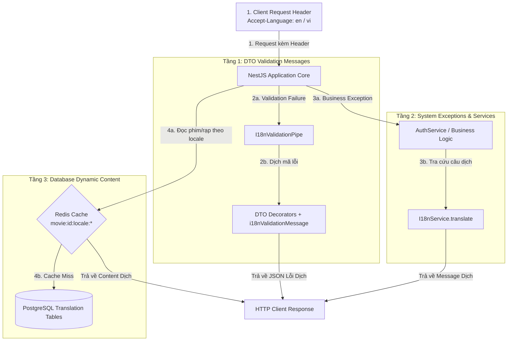

# Chiến Lược Đa Ngôn Ngữ Hóa Hệ Thống (Multi-Language i18n Strategy)

## TL;DR

Tài liệu này hướng dẫn thiết kế kiến trúc đa ngôn ngữ (**Internationalization - i18n**) cho hệ thống NestJS, loại bỏ hoàn toàn việc hardcode văn bản tiếng Việt. Kiến trúc bao gồm 3 tầng xử lý độc lập: **1. DTO Validation i18n** (`nestjs-i18n` + `i18nValidationMessage`), **2. System & Business Exception i18n** (`I18nService`), và **3. Dynamic Database Content i18n** (Translation Tables + Redis Caching theo từng `locale`).

---

## Trình Bày Trực Quan Kiến Trúc Đa Ngôn Ngữ (i18n Architecture Diagram)



---

## Chi Tiết Triển Khai 3 Tầng Dịch Thuật

### Tầng 1: DTO Validation Messages (`i18nValidationMessage`)

Không hardcode chuỗi thông báo trong DTO. Thay vào đó, truyền Translation Key cho `i18nValidationMessage`:

```typescript
// src/modules/auth/dto/login.dto.ts
import { IsEmail, IsNotEmpty, IsString, MinLength } from "class-validator";
import { i18nValidationMessage } from "nestjs-i18n";

export class LoginDto {
  @IsEmail({}, { message: i18nValidationMessage("validation.isEmail") })
  @IsNotEmpty({ message: i18nValidationMessage("validation.isNotEmpty") })
  email!: string;

  @IsString({ message: i18nValidationMessage("validation.isString") })
  @IsNotEmpty({ message: i18nValidationMessage("validation.isNotEmpty") })
  @MinLength(8, { message: i18nValidationMessage("validation.minLength") })
  password!: string;
}
```

### Tầng 2: System & Business Exception i18n

Inject `I18nService` để tự động dịch thông báo ngoại lệ nghiệp vụ theo ngôn ngữ của Client:

```typescript
// src/modules/auth/auth.service.ts
import { Injectable, ConflictException } from "@nestjs/common";
import { I18nContext, I18nService } from "nestjs-i18n";

@Injectable()
export class AuthService {
  constructor(private readonly i18n: I18nService) {}

  async register(dto: RegisterDto) {
    const userExists = true;
    if (userExists) {
      const message = this.i18n.t("auth.EMAIL_EXISTS", {
        lang: I18nContext.current()?.lang,
      });
      throw new ConflictException(message);
    }
  }
}
```

### Tầng 3: Dynamic Database Content i18n (DB + Redis)

Dữ liệu động (tên phim, mô tả phim, loại vé) được lưu trong bảng dịch và cache theo từng `locale` tại Redis (xem chi tiết tại tệp [[Localization_and_Caching_Strategy]]):

- Key Redis: `movie:<id>:locale:<lang>` (ví dụ: `movie:101:locale:en`).
- Tải truy vấn đọc danh mục phim được phục vụ trực tiếp từ Redis với độ trễ <2ms.

---

## Cấu Trúc File Dịch JSON (Translation Dictionary)

```text
src/
└── i18n/
    ├── vi/
    │   ├── auth.json       <-- {"EMAIL_EXISTS": "Email đã tồn tại"}
    │   └── validation.json <-- {"isEmail": "Email không đúng định dạng"}
    └── en/
        ├── auth.json       <-- {"EMAIL_EXISTS": "Email already exists"}
        └── validation.json <-- {"isEmail": "Invalid email address"}
```

---

## Related Notes & MOC Backlinks

- Thư mục MOC: [[000_Ticket_Booking_MOC]]
- Chiến lược dịch thuật CSDL & Caching Redis: [[Localization_and_Caching_Strategy]]
- Luồng thực thi NestJS Request Lifecycle: [[NestJS_Execution_Workflow_and_Lifecycle]]
