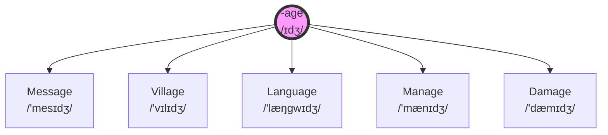

# Phonetic Chunking (Gom nhóm theo âm)

## 💡 TL;DR
Phương pháp học từ vựng bằng cách nhóm các từ có cùng "gốc âm" (Sound Root) hoặc "gốc từ" (Word Root) lại với nhau thành một chùm (Cluster), thay vì học từng từ rời rạc theo danh sách tuyến tính.

---

## 🔍 Deep Dive (Phân tích sâu)

### 1. The Problem: Linear List (Danh sách tuyến tính)
Cách học truyền thống (Rote Memorization) thường liệt kê từ vựng theo bảng chữ cái hoặc ngẫu nhiên (VD: 1. Table, 2. Able, 3. Stable). Não bộ coi đây là các thông tin rời rạc (Unstructured Data), tốn nhiều tài nguyên lưu trữ và dễ quên.

### 2. The Solution: Networked Chunking (Mạng lưới hóa)
Phương pháp này vận dụng nguyên lý **Chunking** (Chia nhỏ và Gom nhóm):
* **The Kernel (Hạt nhân):** Chọn một âm tiết hoặc hậu tố làm gốc (VD: đuôi `-age` phát âm là `/ɪdʒ/` hoặc `/eɪdʒ/`).
* **The Satellites (Vệ tinh):** Tìm tất cả các từ thông dụng chứa gốc đó và liên kết chúng lại quanh hạt nhân.
* **Visual Aid:** Sử dụng **Mind Maps** (Sơ đồ tư duy) để hiển thị mối quan hệ này, kích hoạt trí nhớ hình ảnh (Dual-Coding).

### 3. The Mechanism (Cơ chế hoạt động)
* **Pattern Recognition:** Não bộ cực giỏi nhận diện mẫu. Khi học quy tắc phát âm của gốc `-age`, bạn tự động "unlock" cách đọc của hàng chục từ khác (message, village, damage) mà không cần học từng từ.
* **Systematic Linking:** Tạo ra các móc nối thần kinh. Nhớ từ này sẽ dây mơ rễ má gợi nhớ sang từ kia.

---

## 💻 Code / Example (Ví dụ thực tế)

### Cluster: The `-age` Ending (/ɪdʒ/)
Thay vì học lẻ tẻ, hãy học nguyên một "họ" từ vựng:

### Cluster: The `-air` Sound (/er/)

* **Root:** Air /er/ (Không khí)
* **Branches:**
    * Ch-air (Cái ghế)
    * H-air (Tóc)
    * P-air (Cặp đôi)
    * St-air (Cầu thang)
    * Air-port (Sân bay)

---

## ⚠️ Edge Cases / Pitfalls (Cạm bẫy)

* **False Friends (Bạn giả):** Những từ nhìn giống nhau nhưng đọc khác nhau hoàn toàn (Ngoại lệ của quy tắc).
    * VD: `Massage` (/məˈsɑːʒ/) kết thúc bằng `-age` nhưng đọc là /ɑːʒ/ (âm Pháp), không phải /ɪdʒ/ như `Message`. Nếu áp dụng máy móc Phonetic Chunking sẽ bị sai phát âm.
* **Word Stress Shift (Trọng âm):** Cùng một nhóm từ nhưng trọng âm có thể rơi khác nhau, làm biến đổi âm tiết gốc.
    * VD: `Percentage` (/pɚˈsen.t̬ɪdʒ/) vs `Teenager` (/ˈtiːnˌeɪ.dʒɚ/).

---

## 🔗 Related Keywords
* [[Mind_Map_Method]] (Sơ đồ tư duy)
* [[Linguistic_False_Friends]] (Các từ đồng dạng dễ gây nhầm lẫn)
* [[Dual_Coding_Theory]] (Lý thuyết mã hóa kép: Hình ảnh + Ngôn ngữ)
* [[Cognitive_Load_Theory]] (Lý thuyết tải nhận thức)