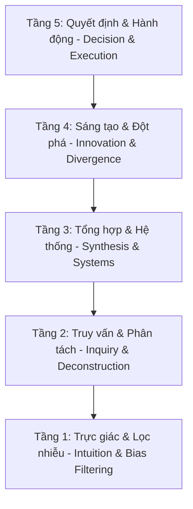

# Cognitive Stack Framework

## TL;DR

Khung phân cấp nhận thức (Cognitive Stack Framework) là hệ quy chiếu tổ chức các mô hình tư duy (Mental Models) theo 5 tầng từ thấp đến cao, đi từ việc lọc nhiễu thông tin thô đến đưa ra hành động tối ưu. Mô hình phân cấp này được chứng thực bởi nghiên cứu khoa học hành vi và giáo dục, giúp giới tri thức nâng cao năng lực tự học sâu (Deep Learning) và đưa ra các quyết định chiến lược trong cuộc sống (Life Path).

---

## Core Concept

Khung phân cấp nhận thức giải quyết bài toán "quá tải thông tin" và "tê liệt phân tích" (Analysis Paralysis) bằng cách sắp xếp các công cụ tư duy theo đúng chu trình xử lý tự nhiên của não bộ.

Một tư duy đơn lẻ như Thiên kiến xác nhận (Confirmation Bias) chỉ là một bộ lọc phòng thủ để làm sạch dữ liệu đầu vào. Để phát triển trí tuệ vượt bậc và giải quyết các bài toán phức tạp trong học tập và đường đời, người tư duy cần phối hợp một tập hợp các mô hình tư duy kiến tạo hoạt động ở các tầng trừu tượng khác nhau.

---

## The 5-Layer Cognitive Stack

### Tầng 1: Trực giác & Lọc nhiễu (Intuition & Bias Filtering)

- **Bản chất:** Tầng tiền xử lý dữ liệu. Nhận diện các phản xạ nhanh của Hệ thống 1 (Fast Thinking) để lọc sạch các lỗi nhận thức tự nhiên trước khi đưa vào phân tích chuyên sâu.
- **Các mô hình cốt lõi:**
  - _Confirmation Bias (Thiên kiến xác nhận):_ Tránh việc chỉ tìm kiếm bằng chứng ủng hộ ý kiến sẵn có.
  - _Survivorship Bias (Thiên kiến kẻ sống sót):_ Tránh việc chỉ học hỏi từ những trường hợp thành công nổi bật.
  - _Sunk Cost Fallacy (Ngụy biện chi phí chìm):_ Tránh việc tiếp tục đầu tư vào con đường sai lầm chỉ vì tiếc công sức đã bỏ ra.
- **Ứng dụng trong Học tập & Đường đời:** Đảm bảo điểm bắt đầu của mọi suy nghĩ là dữ liệu khách quan, không bị bóp méo (nguyên lý "Garbage In, Garbage Out").

### Tầng 2: Truy vấn & Phân tách Nguyên bản (Inquiry & Deconstruction)

- **Bản chất:** Bóc tách các vấn đề phức tạp thành các chân lý/sự thật cơ bản nhất (Facts) không thể chối cãi, phá vỡ các định kiến kế thừa hoặc tư duy bắt chước (Analogy).
- **Các mô hình cốt lõi:**
  - _First Principles Thinking (Tư duy nguyên lý gốc):_ Phân rã vấn đề đến cấp độ vật lý/toán học hoặc giá trị nguyên bản để tái cấu trúc.
  - _Socratic Questioning (Đặt câu hỏi kiểu Socrates):_ Liên tục truy vấn các giả định ngầm (assumptions) để làm sáng tỏ bản chất luận điểm.
- **Ứng dụng trong Học tập & Đường đời:** Giúp người học thấu hiểu tận gốc kiến thức (Cook vs. Chef), không học vẹt, và giúp giới tri thức nhìn thấy cơ hội đột phá từ những giới hạn vật lý thực tế.

### Tầng 3: Tư duy Hệ thống & Quan hệ Liên kết (Systems Thinking & Synthesizing)

- **Bản chất:** Lắp ghép các mảnh sự thật đã bóc tách ở Tầng 2 vào bức tranh tổng thể để quan sát mối liên hệ phức tạp, vòng lặp phản hồi (Feedback loops) và hệ quả lâu dài.
- **Các mô hình cốt lõi:**
  - _Systems Thinking (Tư duy hệ thống):_ Nhìn nhận toàn bộ phần mềm, tổ chức hoặc xã hội dưới dạng các phần tử và các ràng buộc tương tác qua lại.
  - _Second-Order Thinking (Tư duy hệ quả bậc hai):_ Đặt câu hỏi "Và sau đó là gì?" để dự đoán tác động dây chuyền của một hành động.
- **Ứng dụng trong Học tập & Đường đời:** Tránh lỗi tối ưu hóa cục bộ nhưng làm hỏng toàn cục (Local vs. Global Optimization) và giúp tri thức trẻ dự đoán trước các rủi ro hệ thống dài hạn.

### Tầng 4: Sáng tạo & Đa chiều (Innovation & Divergent Thinking)

- **Bản chất:** Tìm kiếm lối đi mới, các giải pháp đột phá phi truyền thống khi các quy luật vật lý (Tầng 2) và ràng buộc hệ thống (Tầng 3) đã được xác định rõ.
- **Các mô hình cốt lõi:**
  - _Lateral Thinking (Tư duy đa chiều):_ Thay đổi góc tiếp cận vấn đề theo các hướng không ngờ tới thay vì tư duy logic dọc truyền thống.
  - _Design Thinking (Tư duy thiết kế):_ Tập trung vào hành vi thực tế và trải nghiệm người dùng cuối cùng để thiết kế giải pháp.
- **Ứng dụng trong Học tập & Đường đời:** Giúp tạo ra các sáng kiến độc đáo, phát minh công nghệ mới hoặc các hướng đi sự nghiệp đột phá mà người khác không nhìn thấy.

### Tầng 5: Quyết định Chiến lược & Thực thi (Strategic Decision & Execution)

- **Bản chất:** Tầng ra quyết định và tối ưu hóa hành động dưới áp lực của sự bất định và các giới hạn tài nguyên (thời gian, tiền bạc, năng lượng).
- **Các mô hình cốt lõi:**
  - _Probabilistic Thinking (Tư duy xác suất):_ Đánh giá rủi ro và phần thưởng dựa trên phân phối xác suất thay vì tư duy nhị phân đúng/sai.
  - _Opportunity Cost (Chi phí cơ hội):_ Đánh giá sự đánh đổi giữa các lựa chọn để tối ưu hóa việc phân bổ nguồn lực.
  - _Deliberate Practice (Luyện tập có chủ đích):_ Tập trung vào vùng khó khăn của bản thân để liên tục nâng cao kỹ năng thực chiến.
- **Ứng dụng trong Học tập & Đường đời:** Giúp đưa ra quyết định đầu tư, lựa chọn sự nghiệp, và thực thi các dự án hiệu quả dưới điều kiện thông tin thiếu nhất quán.

---

## Why This Framework Elevates the Intellectual Mind

1. **Chuyển đổi từ Tư duy Thụ động sang Chủ động:**
   Nghiên cứu giáo dục chỉ ra rằng giới tri thức thường rơi vào cạm bẫy của việc thu thập thông tin thụ động. Việc phân cấp nhận thức buộc bộ não chuyển từ trạng thái lọc lỗi (Tầng 1 - Thụ động) sang phân tách bản chất (Tầng 2), nhìn nhận cấu trúc (Tầng 3) và kiến tạo giá trị thực tế (Tầng 4 & 5 - Chủ động).
2. **Ngăn ngừa Hiện tượng Tê liệt Phân tích:**
   Biết rõ vị trí của vấn đề nằm ở tầng nào để dùng công cụ tương ứng. Tránh việc áp dụng nhầm công cụ (ví dụ: dùng quá nhiều tư duy phản biện phản biện ở tầng 4 khiến dập tắt các ý tưởng sáng tạo non trẻ, hoặc dùng tư duy trực giác ở tầng 5 khi cần phân tích xác suất toán học).
3. **Tăng tốc Năng lực Tự Học (Metacognition):**
   Giúp lập trình viên và người học tự kiểm soát dòng suy nghĩ của mình (Thinking about Thinking). Khi giải pháp thực thi (Tầng 5) thất bại, họ biết cách truy vấn ngược lại các ràng buộc hệ thống (Tầng 3) hoặc các giả định thô ban đầu (Tầng 2).

---

## Related Notes

- Công cụ lọc thiên kiến nhận thức cơ bản: [[Confirmation_Bias]]
- Tổng quan các mô hình tư duy phản biện: [[Critical_Thinking_Models]]
- Bản đồ khái niệm tâm lý học: [[000_Concepts_MOC]]
- Phương pháp bóc tách vấn đề từ gốc: [[First_Principles_Thinking]]
- Tư duy toàn cảnh trong kỹ nghệ phần mềm: [[Systems_Thinking]]
- Kỹ năng đặt câu hỏi sâu phản biện giả định: [[Socratic_Questioning_Method]]
