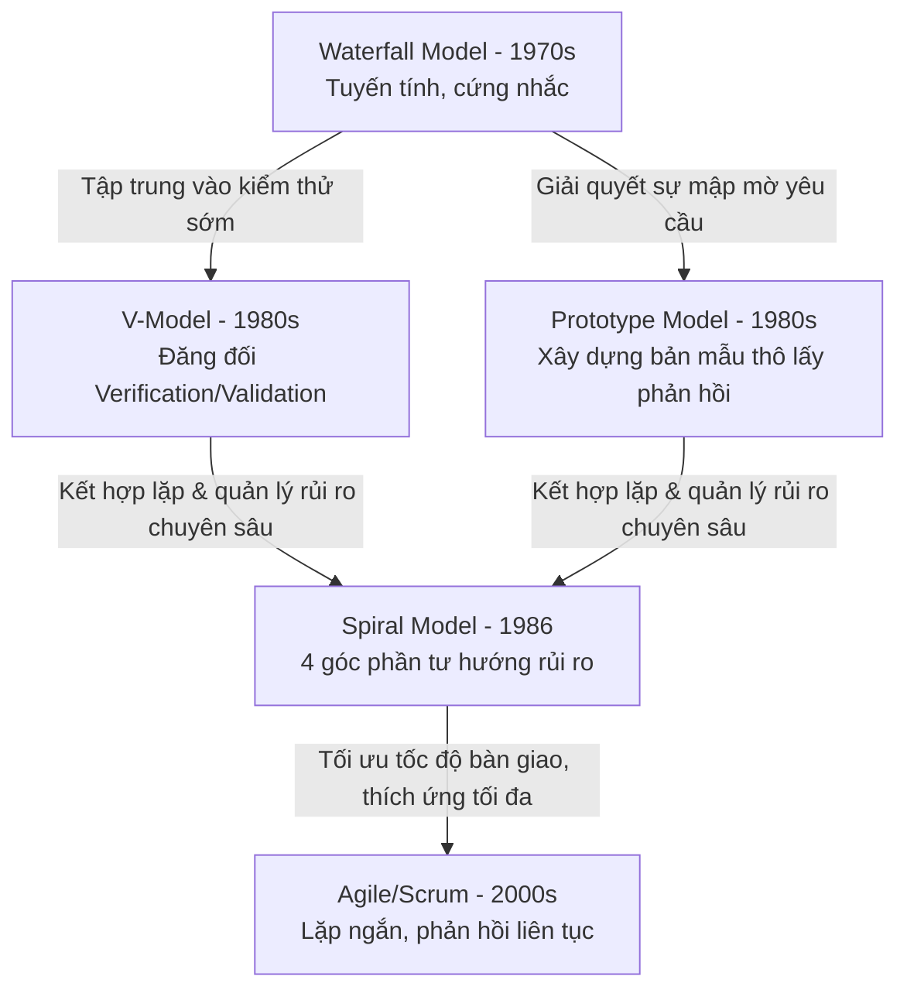

# Lịch Sử Tiến Hóa Của Các Mô Hình SDLC

## TL;DR

Lịch sử phát triển các mô hình Vòng đời Phát triển Phần mềm (SDLC) là một tiến trình chuyển dịch từ các phương pháp lập kế hoạch tuyến tính, cứng nhắc (Plan-driven như Waterfall, V-Model) sang các phương pháp linh hoạt, thích ứng nhanh và hướng giá trị (Value-driven như Agile/Scrum). Sự thay đổi này được thúc đẩy bởi sự phức tạp ngày càng tăng của phần mềm và nhu cầu kiểm soát rủi ro, tối ưu hóa thời gian đưa ra thị trường (Time-to-market).

---

## Sơ Đồ Tiến Hóa SDLC

---

## Chi Tiết Các Cột Mốc Tiến Hóa

### 1. Waterfall Model (Thập kỷ 1970) - Điểm Khởi Đầu

- **Bối cảnh:** Bắt nguồn từ các ngành kỹ thuật truyền thống (xây dựng, sản xuất phần cứng). Được Winston Royce mô tả năm 1970.
- **Hạn chế thúc đẩy tiến hóa:** Khi yêu cầu nghiệp vụ thay đổi hoặc kiểm thử ở cuối dự án phát hiện lỗi thiết kế nghiêm trọng, chi phí sửa chữa cực kỳ đắt đỏ, thường dẫn đến trễ hạn và vượt ngân sách.

### 2. V-Model (Thập kỷ 1980) - Đưa Kiểm Thử Lên Hàng Đầu

- **Tiến hóa từ Waterfall:** Khắc phục hạn chế _"kiểm thử quá muộn"_ bằng cách bắt cặp song song từng pha thiết kế (Verification) với một pha kiểm thử (Validation).
- **Hạn chế còn tồn tại:** Vẫn giữ nguyên tính chất tuyến tính và đóng băng yêu cầu từ đầu. Rất khó phản ứng với các thay đổi yêu cầu từ phía khách hàng.

### 3. Prototype Model (Thập kỷ 1980) - Giải Quyết Sự Mơ Hồ Về Yêu Cầu

- **Tiến hóa từ Waterfall:** Khắc phục hạn chế _"khách hàng không rõ mình muốn gì"_. Cho phép xây dựng nhanh các bản mẫu thô để người dùng tương tác và chỉnh sửa thiết kế trước khi lập trình chính thức.
- **Hạn chế còn tồn tại:** Dễ dẫn đến việc bỏ qua tài liệu thiết kế hệ thống vững chắc và khách hàng lầm tưởng bản mẫu là sản phẩm thật đã hoàn thành.

### 4. Spiral Model (1986) - Quản Lý Rủi Ro Hệ Thống

- **Tiến hóa từ Waterfall & Prototype:** Do Barry Boehm đề xuất, tích hợp tính lặp của Prototype và sự kiểm soát của Waterfall thông qua **phân tích rủi ro**.
- **Hạn chế còn tồn tại:** Quy trình quá phức tạp, tốn kém chi phí cho các chuyên gia đánh giá rủi ro và không phù hợp với dự án nhỏ/vừa.

### 5. Agile & Scrum (2001) - Cách Mạng Linh Hoạt & Hướng Giá Trị

- **Tiến hóa từ các mô hình trước:** Codified thông qua _Agile Manifesto (2001)_. Thay thế tư duy lập kế hoạch đóng băng bằng tư duy thích ứng liên tục qua các Sprint ngắn, cộng tác trực tiếp với khách hàng và kiểm thử tích hợp liên tục.
- **Hiện trạng:** Trở thành mô hình phổ biến nhất hiện nay, mở rộng thêm bằng các tư duy DevOps / DevSecOps để tăng tốc bàn giao.

---

**Related Notes:**

- [[Waterfall]]
- [[V_Model]]
- [[Prototype_Model]]
- [[Spiral_Model]]
- [[Agile_Scrum]]
