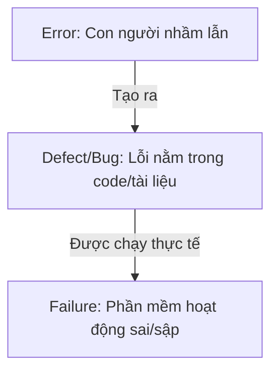

# Phân biệt Error, Defect (Bug) và Failure

## TL;DR

Trong kiểm thử phần mềm, việc phân biệt rõ giữa Error (Sai sót), Defect/Bug (Lỗi trong code/tài liệu) và Failure (Sự cố khi vận hành) là vô cùng quan trọng. Sự nhầm lẫn của con người (Error) dẫn đến khuyết tật trong hệ thống (Defect), và khi khuyết tật đó được thực thi sẽ tạo ra hoạt động sai lệch thực tế của phần mềm (Failure).

---

## Core Concept

Mối quan hệ nhân quả giữa ba khái niệm này được định nghĩa chuẩn xác theo tài liệu ISTQB như sau:

- **Error (Mistake - Sai sót/Nhầm lẫn):**
  - **Bản chất:** Hành động sai lầm của **con người** (con người là chủ thể tạo ra).
  - **Nguyên nhân:** Do lập trình viên hiểu sai thuật toán, Business Analyst (BA) viết sai yêu cầu đặc tả, hoặc do áp lực thời gian, thiếu tập trung.
- **Defect (Bug/Fault/Khuyết tật - Lỗi):**
  - **Bản chất:** Một khuyết tật hoặc điểm không chính xác nằm **trong mã nguồn hoặc tài liệu** (tài liệu thiết kế, tài liệu yêu cầu).
  - **Đặc điểm:** Defect là kết quả trực tiếp của một _Error_. Nếu đoạn mã nguồn chứa defect không bao giờ được chạy qua, defect đó sẽ ở trạng thái tĩnh và không gây ảnh hưởng trực tiếp đến người dùng.
- **Failure (Sự cố):**
  - **Bản chất:** Hiện tượng phần mềm hoạt động **sai lệch so với mong đợi** hoặc không thực hiện được chức năng yêu cầu khi vận hành thực tế.
  - **Đặc điểm:** Failure chỉ xảy ra ở trạng thái động (Dynamic) khi phần mềm được thực thi và chạy qua dòng code chứa _Defect_.
  - _Lưu ý:_ Không phải mọi Defect đều dẫn đến Failure (ví dụ: code chết không bao giờ chạy tới), và Failure cũng có thể do môi trường (mất mạng, lỗi phần cứng) chứ không phải do code.

---

## Practical Examples

### Ví dụ 1: Lỗi lập trình tính toán giảm giá

- **Error:** Lập trình viên viết nhầm công thức tính thuế suất trên hóa đơn (viết nhầm dấu chia `/` thành dấu nhân `*`).
- **Defect:** Đoạn code công thức tính toán trong file `invoice.js` chứa dấu nhân `*` thay vì dấu chia `/`.
- **Failure:** Khách hàng thanh toán và hóa đơn hiển thị số tiền thuế tăng vọt lên gấp 100 lần thực tế.

### Ví dụ 2: Lỗi tài liệu đặc tả yêu cầu (Requirement)

- **Error:** BA hiểu nhầm yêu cầu của khách hàng về độ tuổi đăng ký tài khoản (khách hàng yêu cầu >= 18, BA nghĩ là > 18).
- **Defect:** Tài liệu đặc tả yêu cầu ghi: _"Người dùng phải trên 18 tuổi mới được đăng ký"_.
- **Failure:** Một người dùng đúng 18 tuổi điền thông tin đăng ký nhưng hệ thống báo lỗi không cho phép tạo tài khoản.

---

## Related Notes

- [[30_Resources/Concepts/000_Concepts_MOC.md|Concepts MOC]]
