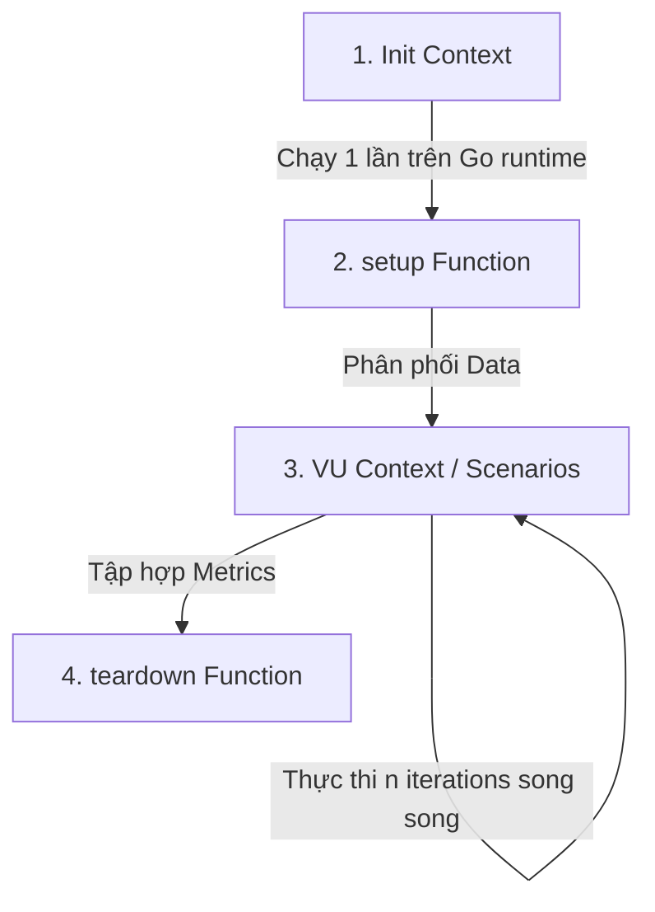

---
tags:
  [
    type/concept,
    topic/testing,
    topic/engineering,
    topic/memory-management,
    layer/core-mechanics,
  ]
date: 2026-08-28
aliases:
  [
    k6 Lifecycle,
    k6 Goja Memory Model,
    k6 SharedArray,
    Virtual Users Execution Context,
    k6/execution,
  ]
description: "Vòng đời thực thi 4 pha, cơ chế cô lập bộ nhớ Goja VM và module k6/execution trong Grafana k6."
---

# k6 Execution Lifecycle & Memory Architecture

## TL;DR

- **Bản chất**: k6 thực thi kịch bản bằng các máy ảo Goja JavaScript độc lập được quản lý bởi Go runtime chính.
- **Mục đích**: Phân lập hoàn toàn không gian bộ nhớ giữa các Virtual User (VU), ngăn chặn rò rỉ RAM khi scale hàng nghìn VU đồng thời.
- **Điểm mấu chốt**: Dữ liệu dùng chung (fixtures, tokens) bắt buộc nạp qua `SharedArray` ở Init Context để lưu trữ 1 bản duy nhất trên Go heap; truy xuất ngữ cảnh thực thi hiện đại qua module `k6/execution` thay cho biến global `__VU` / `__ITER`.

---

## Core Concept

### 1. Vòng đời Thực thi 4 Pha (Execution Lifecycle)



1. **Init Context**:
   - Chạy 1 lần duy nhất trên Go runtime chính trước khi khởi tạo VU.
   - Nhiệm vụ: Import modules, định nghĩa `options`, cấu hình `thresholds`, đọc file tĩnh (`open()`, `new SharedArray()`).
   - Ràng buộc: Cấm tuyệt đối HTTP requests hoặc tác vụ bất đồng bộ.
2. **`setup()` (Optional)**:
   - Chạy 1 lần trên 1 VU độc lập trước khi tải bắt đầu.
   - Nhiệm vụ: Chuẩn bị dữ liệu động qua HTTP (lấy admin token, seed môi trường). Trả về dữ liệu `data` truyền thẳng vào VU Context và `teardown()`.
3. **VU Context (Default / Scenario Functions)**:
   - Chạy lặp lại song song trên từng Goja VM độc lập theo lịch điều phối của Executor.
   - Nhiệm vụ: Gửi HTTP requests, đo lường độ trễ, ghi nhận Custom Metrics, đánh giá `check()`.
4. **`teardown(data)` (Optional)**:
   - Chạy 1 lần sau khi toàn bộ VUs kết thúc kịch bản.
   - Nhiệm vụ: Dọn dẹp tài nguyên động trên server, đối soát trạng thái kiểm thử.

---

### 2. Mô hình Cô lập Bộ nhớ Goja (Memory Isolation)

```
┌──────────────────────────────────────────────────────────────┐
│                        k6 Go Runtime                         │
│                                                              │
│  ┌────────────────────────────────────────────────────────┐  │
│  │           SharedArray Memory (Go Heap / Read-Only)     │  │
│  │           [Token 1, Token 2, ..., Token 2000]          │  │
│  └────────────▲────────────────────────────▲──────────────┘  │
│               │ (Zero-copy Pointer)        │                 │
│  ┌────────────┴────────────┐  ┌────────────┴────────────┐    │
│  │    VU 1 (Goja VM #1)    │  │    VU N (Goja VM #N)    │    │
│  │    - Local Scope & GC   │  │    - Local Scope & GC   │    │
│  │    - exec.vu.idInTest=1 │  │    - exec.vu.idInTest=N │    │
│  └─────────────────────────┘  └─────────────────────────┘    │
└──────────────────────────────────────────────────────────────┘
```

- **Tính chất cô lập**: Không có bộ nhớ chia sẻ (Shared Memory) giữa các Goja VM. Biến toàn cục khai báo tại VU 1 không thể nhìn thấy hay làm đột biến giá trị tại VU 2.
- **`k6/execution` API (Thay thế `__VU`, `__ITER`)**:
  - Lưu ý: Tên module chuẩn là `k6/execution` (danh từ chỉ runtime execution, không phải `k6/executor` - vốn là trường cấu hình trong scenarios).
  - Khuyến nghị sử dụng Named Imports (`import { vu, scenario, test } from "k6/execution"`) để tương thích hoàn toàn với TypeScript & ESLint:
    - `vu.idInTest`: ID định danh duy nhất của VU trong toàn bộ test run (1-indexed).
    - `vu.iterationInInstance`: Số thứ tự iteration của VU trên instance runner hiện tại.
    - `scenario.iterationInTest`: Số thứ tự iteration của toàn kịch bản (dùng phân phối unique data).
    - `test.abort()`: Dừng khẩn cấp toàn bộ test run khi phát hiện lỗi nghiêm trọng.

---

### 3. Phân biệt `open()` + `JSON.parse()` vs `SharedArray`

| Tiêu chí                       | `open()` + `JSON.parse()`                                               | `SharedArray` (`k6/data`)                                     |
| :----------------------------- | :---------------------------------------------------------------------- | :------------------------------------------------------------ |
| **Vị trí lưu trữ**             | Nhân bản vào từng Goja VM của mỗi VU                                    | Lưu 1 bản duy nhất trên Go Heap                               |
| **RAM (2,000 VUs - File 5MB)** | $5\text{MB} \times 2000 = \mathbf{10\text{GB}}$ $\rightarrow$ Crash OOM | $5\text{MB} \times 1 = \mathbf{5\text{MB}}$ (Tiết kiệm 99.9%) |
| **Đặc tính an toàn**           | Có thể bị đột biến cục bộ                                               | Read-only mảng tĩnh, thread-safe tuyệt đối                    |

---

## Practical Implementation

```typescript
import { post } from "k6/http";
import { check } from "k6";
import { SharedArray } from "k6/data";
import { vu, test } from "k6/execution";

interface UserCredential {
  id: string;
  token: string;
  ip: string;
}

// 1. INIT CONTEXT: Load fixture 1 lần duy nhất vào Go memory
const users = new SharedArray<UserCredential>("user_pool", () => {
  return JSON.parse(open("./fixtures/users.json")) as UserCredential[];
});

export const options = {
  discardResponseBodies: true, // Tiết kiệm RAM khi không parse response body
  scenarios: {
    stress: {
      executor: "per-vu-iterations",
      vus: 500,
      iterations: 1,
      maxDuration: "10s",
    },
  },
};

// 2. VU CONTEXT: Truy xuất qua k6/execution API
export default function (): void {
  // Ánh xạ an toàn không trùng lặp qua idInTest
  const userIndex = (vu.idInTest - 1) % users.length;
  const user = users[userIndex];

  if (!user) {
    test.abort("User credentials partition missing");
    return;
  }

  const res = post(
    "http://127.0.0.1:3000/api/v1/booking",
    JSON.stringify({ seatId: "VIP-01" }),
    {
      headers: {
        "Content-Type": "application/json",
        Authorization: `Bearer ${user.token}`,
        "X-Forwarded-For": user.ip,
      },
    },
  );

  check(res, {
    "status valid": (r) => r.status === 201 || r.status === 409,
  });
}
```

---

## Related Notes

- Mô hình kịch bản thực thi k6: [[K6_Scenario_Executors_and_Workload_Modeling]]
- Hệ thống đo lường và ngưỡng kiểm định k6: [[K6_Telemetry_Metrics_and_Threshold_Gates]]
- Quy chuẩn kiểm thử tải Concurrency: [[K6_High_Concurrency_Load_Testing_SOP]]
- Nguyên lý quản lý bộ nhớ nền tảng: [[Stack_vs_Heap_Memory_Fundamentals]]
- Hướng dẫn Benchmark cục bộ: [[Local_Stress_Testing_Benchmark]]
- Bản đồ tri thức kiểm thử: [[30_Resources/Concepts/000_Concepts_MOC.md|Concepts MOC]]
