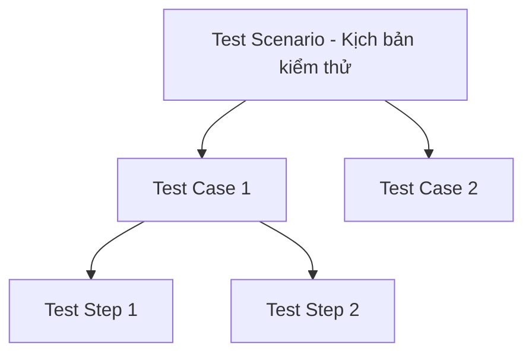

# Test Case (Trường hợp kiểm thử)

## TL;DR

Test Case (trường hợp kiểm thử) là một tình huống kiểm tra được thiết kế để xác minh xem một đối tượng (chức năng/hệ thống) có thỏa mãn yêu cầu đặt ra hay không. Một test case cơ bản bao gồm 3 bước: **Mô tả** (các điều kiện cần có), **Nhập** (dữ liệu đầu vào), và **Kết quả mong chờ** (kết quả trả về từ đối tượng kiểm tra).

---

## Core Concept

Theo tài liệu đào tạo và slide hướng dẫn, các khái niệm cốt lõi của một Test Case được quy định cụ thể như sau:

### Định nghĩa

**Test Case** là một tình huống kiểm tra, được thiết kế để kiểm tra một đối tượng có thoả mãn yêu cầu đặt ra hay không.

### 3 Bước Cơ Bản

Một test case luôn bao gồm 3 thành phần chính:

1. **Mô tả:** Các điều kiện cần có để tiến hành kiểm tra (ví dụ: trạng thái hệ thống, cấu hình thiết bị, người dùng chưa đăng nhập).
2. **Nhập:** Dữ liệu cần thiết làm đầu vào để kiểm tra (ví dụ: thông tin tài khoản, mật khẩu, file tải lên).
3. **Kết quả mong chờ:** Kết quả trả về từ đối tượng kiểm tra sau khi thực hiện (ví dụ: thông báo lỗi, chuyển trang thành công).

### Phân cấp: Test Scenario → Test Case → Test Step

Mối quan hệ giữa các thành phần trong kịch bản kiểm thử được cấu trúc từ nhỏ đến lớn:

- Test step (Bước kiểm thử): 1 hành động để thực hiện và đáp ứng mong đợi.
- Test case (Trường hợp kiểm thử): Danh sách các _Test step_ kết hợp lại để kiểm tra một tình huống cụ thể.
- Test scenario (Kịch bản kiểm thử): Danh sách các _test case_ và sự phối hợp của chúng để kiểm tra một luồng nghiệp vụ hoàn chỉnh.

---

## Concrete Examples

Dưới đây là bảng ví dụ trực quan về 2 test case cho chức năng Đăng nhập (Login):

| ID        | Tên Test Case                             | Mô tả (Điều kiện)                                  | Nhập (Dữ liệu)                                         | Các bước thực hiện (Test Steps)                                                    | Kết quả mong chờ                                                              |
| :-------- | :---------------------------------------- | :------------------------------------------------- | :----------------------------------------------------- | :--------------------------------------------------------------------------------- | :---------------------------------------------------------------------------- |
| **TC-01** | Đăng nhập thành công với tài khoản hợp lệ | Người dùng đã mở trình duyệt và truy cập trang chủ | - Username: `john.doe` - Password: `SecurePass123!` | 1. Mở trang `/login`. 2. Nhập Username và Password. 3. Nhấn nút "Đăng nhập". | - Hệ thống đăng nhập thành công. - Điều hướng về trang Dashboard.          |
| **TC-02** | Đăng nhập thất bại do sai mật khẩu        | Người dùng đã mở trình duyệt và truy cập trang chủ | - Username: `john.doe` - Password: `WrongPassword`  | 1. Mở trang `/login`. 2. Nhập Username và Password. 3. Nhấn nút "Đăng nhập". | - Hiển thị thông báo lỗi màu đỏ: _"Tài khoản hoặc mật khẩu không chính xác"_. |

---

## Related Notes

- [[Error_Defect_Failure]]: Hiểu rõ sự khác biệt giữa lỗi thiết kế, lỗi code và sự cố thực tế khi chạy thử.
- [[7_Principles_of_Testing]]: Các triết lý cốt lõi giúp thiết kế test case hiệu quả và thực tế.
- [[Black_Box_Testing_Techniques]]: Sử dụng phân vùng tương đương và phân tích giá trị biên để tối ưu hóa việc chọn Dữ liệu đầu vào (Test Data).
- [[30_Resources/Concepts/000_Concepts_MOC.md|Concepts MOC]]
