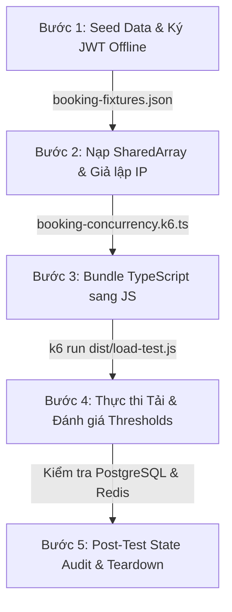

---
tags:
  [type/method, topic/testing, topic/engineering, topic/backend, layer/quality]
date: 2026-08-28
aliases:
  [
    k6 Concurrency SOP,
    k6 Load Testing Workflow,
    High Concurrency Testing Protocol,
  ]
description: "Quy chuẩn quy trình 5 bước thiết lập và thực thi kiểm thử tải tranh chấp đồng thời (High-Concurrency) với Grafana k6."
---

# High-Concurrency Load Testing SOP with Grafana k6

## TL;DR

- **Mục đích**: Quy chuẩn hóa quy trình 5 bước kiểm thử tải tranh chấp cao (500 - 2,000 VUs) để kiểm định Distributed Lock, Pessimistic Locking và Rate Limiter.
- **Vấn đề giải quyết**: Triệt tiêu 3 cạm bẫy: False Bottleneck (nghẽn CPU do Auth login), IP Collision (Throttler chặn 429 do trùng IP runner), và RAM Explosion (nhân bản fixture trên từng VU).
- **Điểm mấu chốt**: Ký JWT offline $\rightarrow$ Nạp qua `SharedArray` $\rightarrow$ Giả lập IP bằng `X-Forwarded-For` $\rightarrow$ Bundle TypeScript sang Goja JS $\rightarrow$ Đối soát Database State trực tiếp sau test.

---

## Context: When to apply?

Áp dụng quy chuẩn này khi:

1. Phát triển các tính năng có tính tranh chấp cao: Đặt vé máy bay/rạp phim (Seat Reservation), Flash-Sale, Ví điện tử / Chuyển tiền.
2. Cần kiểm định tính toàn vẹn của khóa phân tán ([[Redis_Redlock]]) và khóa bi quan ([[Postgres_Select_For_Update_Pessimistic_Locking]]) nhằm đảm bảo **Zero Double-Booking**.
3. Cần thiết lập cổng kiểm soát chất lượng (Quality Gate) tự động trong CI/CD.

---

## Step-by-Step Execution Protocol



### Bước 1: Seed Dữ liệu & Ký JWT Token Offline

- **Cơ chế**: Tuyệt đối không cho VUs gọi HTTP `POST /auth/login` trong k6 vì thuật toán hash mật khẩu (Scrypt/Argon2/Bcrypt) sẽ làm nghẽn CPU trước khi request chạm tới module nghiệp vụ.
- **Hành động**:
  1. Viết script seed (`seed.ts`) tạo trước $N$ user trong Database.
  2. Ký trước $N$ token JWT hợp lệ bằng `JWT_SECRET` của dự án.
  3. Xuất toàn bộ dữ liệu ra file JSON gọn nhẹ (`booking-fixtures.json`).

### Bước 2: Nạp Dữ liệu qua SharedArray & Giả lập Header IP

- **Cơ chế**: Chạy k6 trên 1 máy runner khiến tất cả requests xuất phát từ `127.0.0.1`. Rate Limiter sẽ chặn từ request thứ 11 (HTTP 429), ngăn cản request chạm vào logic khóa ghế.
- **Hành động**:
  1. Sử dụng `SharedArray` để nạp `booking-fixtures.json` 1 lần duy nhất vào Go memory.
  2. Phân phối token cho từng VU qua `vu.idInTest` (`import { vu } from "k6/execution"`).
  3. Mỗi VU gán IP giả lập riêng biệt qua `X-Forwarded-For: 10.0.${Math.floor(id/256)}.${id%256}` kết hợp cấu hình `trust proxy` trên server.
  4. Tạo `idempotency-key` duy nhất cho từng request bằng UUIDv7.

### Bước 3: Đóng gói TypeScript sang chuẩn Goja Runtime

- **Cơ chế**: k6 chạy trên Goja JavaScript engine, không hỗ trợ TypeScript và các module native của Node.js (`fs`, `crypto`, `path`).
- **Hành động**:
  - Đóng gói kịch bản TypeScript thành file JavaScript độc lập trước khi chạy:
    ```bash
    bun build test/load/booking-concurrency.k6.ts --target=browser --outfile dist/load-test.js
    ```

### Bước 4: Thực thi Tải với Ngưỡng Bất biến (Invariant Thresholds)

- **Hành động**:
  - Chạy k6 với executor `per-vu-iterations` (`iterations: 1`) để tạo xung đột tức thời tại $t=0$.
  - Cấu hình Thresholds nghiêm ngặt để xác thực tính đúng đắn toán học:
    ```typescript
    thresholds: {
      reserve_success_201: ["count==1"],                  // Duy nhất 1 ghế được giữ
      reserve_conflict_409: [`count==${totalVus - 1}`],   // Còn lại nhận 409
      reserve_unexpected_errors: [
        { threshold: "count==0", abortOnFail: true, delayAbortEval: "1s" }
      ],
    }
    ```

### Bước 5: Đối soát Cơ sở dữ liệu và Thu dọn (Audit & Teardown)

- **Cơ chế**: Báo cáo HTTP 201 của k6 chỉ phản ánh tầng giao tiếp mạng, chưa chứng minh tuyệt đối trạng thái dữ liệu trong database không bị ghi đè ngầm.
- **Hành động**:
  1. Chạy script đối soát sau test:
     - Truy vấn `SELECT count(*) FROM bookings WHERE show_id = :showId` $\rightarrow$ Kết quả **bắt buộc $= 1$**.
     - Truy vấn trạng thái ghế `show_seats` $\rightarrow$ Đúng 1 bản ghi mang trạng thái `reserved`.
     - Kiểm tra Redis key lock $\rightarrow$ Khóa đã được giải phóng hoàn toàn, không bị deadlock.
  2. Xóa sạch dữ liệu test để đảm bảo tính tái lập cho lần chạy sau.

---

## Practical Implementation

```typescript
import { post } from "k6/http";
import { check } from "k6";
import { Counter } from "k6/metrics";
import { SharedArray } from "k6/data";
import { vu } from "k6/execution";
import { v7 as uuidv7 } from "uuid";

interface Fixture {
  targetUrl: string;
  showId: string;
  seatId: string;
  totalVus: number;
  users: Array<{ id: string; token: string; ip: string }>;
}

const fixtureData = new SharedArray<Fixture>("fixtures", () => {
  return [JSON.parse(open("./fixtures/booking-fixtures.json"))];
});
const fixture = fixtureData[0]!;

export const reserve201 = new Counter("reserve_success_201");
export const reserve409 = new Counter("reserve_conflict_409");
export const reserveErrors = new Counter("reserve_unexpected_errors");

export const options = {
  discardResponseBodies: true,
  scenarios: {
    burst_collision: {
      executor: "per-vu-iterations",
      vus: fixture.totalVus,
      iterations: 1,
      maxDuration: "10s",
      gracefulStop: "1s",
    },
  },
  thresholds: {
    reserve_success_201: ["count==1"],
    reserve_conflict_409: [`count==${fixture.totalVus - 1}`],
    reserve_unexpected_errors: [
      { threshold: "count==0", abortOnFail: true, delayAbortEval: "1s" },
    ],
  },
};

export default function (): void {
  const vuId = vu.idInTest;
  const user = fixture.users[(vuId - 1) % fixture.users.length]!;
  const url = `${fixture.targetUrl}/bookings/reserve`;

  const payload = JSON.stringify({
    showId: fixture.showId,
    seatIds: [fixture.seatId],
  });

  const params = {
    headers: {
      "Content-Type": "application/json",
      Authorization: `Bearer ${user.token}`,
      "idempotency-key": uuidv7(),
      "X-Forwarded-For": user.ip,
    },
  };

  const res = post(url, payload, params);

  if (res.status === 201) reserve201.add(1);
  else if (res.status === 409) reserve409.add(1);
  else reserveErrors.add(1);

  check(res, {
    "status is valid": (r) => r.status === 201 || r.status === 409,
    "no 500 error": (r) => r.status !== 500,
  });
}
```

---

## Related Notes

- Kiến trúc bộ nhớ và vòng đời k6: [[K6_Execution_Lifecycle_and_Memory_Architecture]]
- Mô hình kịch bản thực thi k6: [[K6_Scenario_Executors_and_Workload_Modeling]]
- Hệ thống đo lường và ngưỡng kiểm định k6: [[K6_Telemetry_Metrics_and_Threshold_Gates]]
- Cơ chế khóa phân tán Redis Redlock: [[Redis_Redlock]]
- Cơ chế khóa bi quan Postgres: [[Postgres_Select_For_Update_Pessimistic_Locking]]
- Khung hệ thống kiểm định tự động: [[Automated_Verification_System_Framework]]
- Hướng dẫn Benchmark cục bộ: [[Local_Stress_Testing_Benchmark]]
- Bản đồ quy trình kỹ thuật: [[000_Methods_MOC]]
